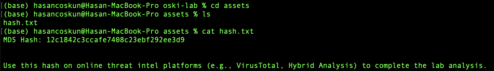
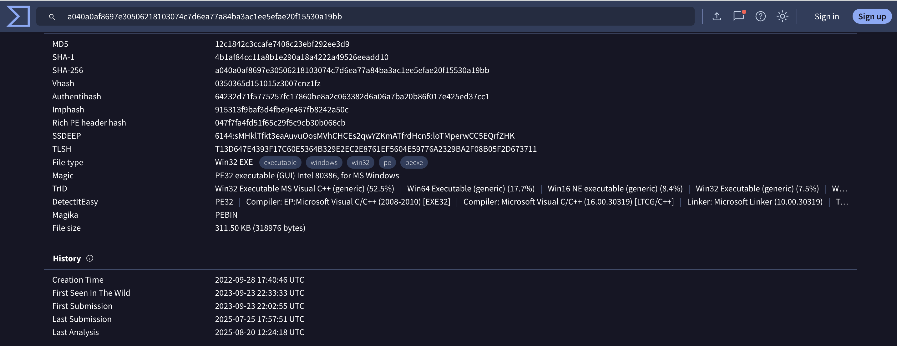
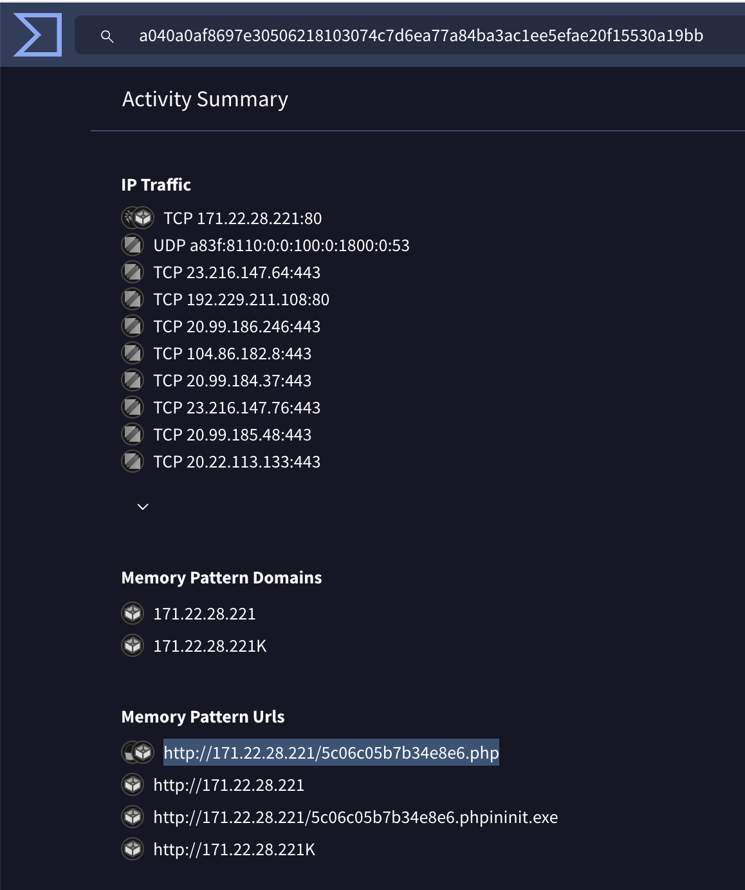

[Türkçe](README.md) | English (this page)

# CyberDefenders Case Walkthrough: Anatomy of an Information Thief (Stealc)

Hello cybersecurity enthusiasts! In this article, we will perform a step-by-step analysis of an "easy" level case on the CyberDefenders platform. This case is an excellent example of how we can uncover the entire lifecycle of a piece of malware starting from just one piece of evidence (an MD5 hash). In our analysis, we will see how to effectively use invaluable online tools such as VirusTotal and Any.run.

Ready? Let's put on our detective hats and begin!

## Crime Scene: Our First Evidence

The case begins with a single **Indicator of Compromise (IOC)**:

- **MD5 Hash:** `12c1842c3ccafe7408c23ebf292ee3d9`

As analysts, our first step is to quickly gather information about the file using this digital fingerprint. Our first stop is usually VirusTotal. VirusTotal quickly tells us that the file has tags such as `exploit`, `cve-2016-0101`, and `malware`. However, the heart of this case lies in the Any.run platform, where we can observe the malware's behaviors live.

---

## Question 1: Malware Creation Time

> **Question:** Determining the creation time of the malware can provide insights into its origin. What was the time of malware creation?

### Analytical Approach

To find the creation time of a piece of malware, we first need to analyze the file using threat intelligence platforms with the hash file provided to us. For this case, the MD5 hash is found in the `hash.txt` file, and we can obtain detailed information about the file by using this hash on platforms like VirusTotal.

### Examining the Evidence

First, let's examine the `hash.txt` file provided to us:

This file contains `MD5 Hash: 12c1842c3ccafe7408c23ebf292ee3d9` and indicates that we should use this hash on online threat intelligence platforms.

Then, we search for this MD5 hash on VirusTotal to obtain detailed information about the file:

In the VirusTotal analysis, the file's **"Creation Time"** value is shown as `2022-09-28 17:40:46 UTC`. This is the creation time of the malware.

**✅ Answer:** `2022-09-28 17:40:46 UTC`

---

## Question 2: Command & Control (C2) Server

> **Question:** Identifying the command and control (C2) server that the malware communicates with can help trace back to the attacker. Which C2 server does the malware in the PPT file communicate with?

### Analytical Approach

To find a malware's C2 server, we need to focus on the BEHAVIOR section in the VirusTotal analysis. This section shows the URLs that the malware holds in memory and network communication patterns. C2 servers are typically detected as dynamic endpoints where POST requests are made.

### Examining the Evidence

In the VirusTotal analysis, we identify the C2 server by examining the **Memory Pattern Urls** section under the BEHAVIOR section:

In the image, when we examine the URLs listed in the **Memory Pattern Urls** section:
- `http://171.22.28.221/5c06c05b7b34e8e6.php`: This URL points to a `.php` script. This is the strongest indicator that dynamic operations (data reception, command sending) are performed on the server side. This is a typical C2 communication channel.
- Other URLs either show just the IP address (`171.22.28.221`) or downloaded files. These are not the communication channel itself, but the target's address or downloaded tools.

Therefore, the C2 server that the malware communicates with is this `.php` address.

**✅ Answer:** `http://171.22.28.221/5c06c05b7b34e8e6.php`

---

## Question 3: First Library Request Post-Infection

> **Question:** Identifying the initial actions of the malware post-infection can provide insights into its primary objectives. What is the first library that the malware requests post-infection?

### Analytical Approach

The key phrase in this question is **"post-infection"**. This means we must assume that the exploit was successful and the malware is now running on the system. From this point on, we must find the first library that the malware requests *to fulfill its own purpose*.

### Examining the Evidence

In the VirusTotal analysis, the first library that the malware requests post-infection is the SQLite library necessary for accessing browser databases.

In the image, the answer to question 3 is the **"sqlite3.dll"** library. This library is the SQLite database library that the malware uses to access browser databases and steal passwords and other credentials.

**✅ Answer:** `sqlite3.dll`

---

## Question 4: RC4 Encryption Key

> **Question:** By examining the provided Any.run report, what RC4 key is used by the malware to decrypt its base64-encoded string?

### Analytical Approach

Malware typically stores sensitive information such as C2 addresses or commands in encrypted form. When they need to use this information, they must decrypt it in memory. Advanced sandboxes like Any.run can automatically detect such cryptographic activities and keys used in memory.

### Examining the Evidence

One of Any.run's most powerful features, the **"Malware configuration"** section, summarizes such information for us. This section shows configuration data that Any.run automatically extracts from memory during analysis.

As seen in the image, Any.run has clearly captured and presented us with the key used for "RC4" under the "Keys" heading.

**✅ Answer:** `5329514621441247975720749009`

---

## Question 5: MITRE ATT&CK Technique Used for Password Theft

> **Question:** By examining the MITRE ATT&CK techniques displayed in the Any.run sandbox report, identify the main MITRE technique (not sub-techniques) the malware uses to steal the user's password.

### Analytical Approach

MITRE ATT&CK is a knowledge base that standardizes cybersecurity attack techniques. Any.run automatically maps the malware's behaviors to this framework. Password theft falls under the **"Credential Access"** tactic. To perform this analysis, we need to use Any.run's Processes Graph section to examine process details.

### Examining the Evidence

In Any.run's **Processes Graph** section, when we click on the `VPN.exe` process, the **Process Details** window that opens shows us the MITRE ATT&CK techniques.

In the image, we see that the malware's behaviors are tagged with MITRE ATT&CK IDs:
- **T1555.003: Credentials from Web Browsers** - This is a *sub-technique* showing that the malware steals credentials from web browsers
- **T1552.001: Credentials In Files** - Shows that it accesses credentials in files

Since the question asks for the **main technique** (not sub-techniques), we must look at the main category that `T1555.003` belongs to. The `.003` part indicates it's a sub-technique, while the main technique is **T1555**.

**✅ Answer:** `T1555: Credentials from Password Stores`

---

## Question 6: Directory Targeted for DLL Deletion

> **Question:** By examining the child processes displayed in the Any.run sandbox report, which directory does the malware target for the deletion of all DLL files?

### Analytical Approach

Malware typically deletes themselves or the components they used after their work is done to avoid leaving traces behind. This action is usually performed using Command Prompt (`cmd.exe`), a legitimate Windows tool. Any.run's **"Behavior activities"** section captures all the details of such commands.

### Examining the Evidence

In Any.run's **Behavior activities** section, when we examine the behavior activities of the `VPN.exe` process, we see that it starts a `cmd.exe` process to delete itself. The command line (Cmdline) of this process tells us the whole story.

In the image, in the **Behavior activities (PID: 3484) VPN.exe** section, the command line executed by cmd.exe is as follows:
`"C:\Windows\system32\cmd.exe" /c timeout /t 5 & del /f /q "C:\Users\admin\AppData\Local\Temp\VPN.exe" & del "C:\ProgramData\*.dll"" & exit`

The last part of this command, `del "C:\ProgramData\*.dll"`, clearly shows that the malware targets **all `.dll` files** in the `C:\ProgramData` directory (thanks to the `*` wildcard character).

**✅ Answer:** `C:\ProgramData`

---

## Question 7: Self-Delete Timing

> **Question:** Understanding the malware's behavior post-data exfiltration can give insights into its evasion techniques. By analyzing the child processes, after successfully exfiltrating the user's data, how many seconds does it take for the malware to self-delete?

### Analytical Approach

Malware typically waits for a certain period after completing the data theft operation before deleting themselves. This timing is strategically determined to ensure that the attacker is confident that the data transfer is complete while minimizing the risk of detection.

### Examining the Evidence

The answer to question 7 can also be found by looking at the image used for question 6. In Any.run's **Behavior activities** section, the `timeout /t 5` command can be seen in the cmd.exe command line of the `VPN.exe` process:

`"C:\Windows\system32\cmd.exe" /c timeout /t 5 & del /f /q "C:\Users\admin\AppData\Local\Temp\VPN.exe" & del "C:\ProgramData\*.dll"" & exit`

The **`timeout /t 5`** part in this command shows that the malware applies a strategic delay of **5 seconds** before deleting itself after completing the data theft operation. This timing is determined to ensure that the attacker is confident that the data transfer is complete while minimizing the risk of detection.

**✅ Answer:** `5 seconds`

---

## Conclusion and Lessons Learned

Starting from a single MD5 hash, we understood that we were dealing with an information thief from the `Stealc/Oski` family that exploits the `cve-2016-0101` vulnerability. This malware:

1. **Was created on 2022-09-28 17:40:46 UTC** - Attacker's activity timing
2. **Connected to C2 server** - To the PHP endpoint at `171.22.28.221`
3. **Downloaded sqlite3.dll library** - For access to browser databases
4. **Used RC4 encryption** - With key `5329514621441247975720749009`
5. **Applied T1555 MITRE technique** - Credential theft from password stores
6. **Targeted DLLs in C:\ProgramData directory** - To avoid leaving traces
7. **Self-deleted after 5 seconds** - After data transfer completion

This case, although labeled as "easy," is an excellent example of how layered and detailed cybersecurity analysis can be. Using triage tools like VirusTotal together with in-depth dynamic analysis platforms like Any.run proves to be a powerful combination for uncovering the entire story of an attack.

---

## 📚 Tools Used

- **VirusTotal** - File analysis and threat intelligence
- **Any.run** - Dynamic malware analysis and sandbox
- **CyberDefenders** - Training platform

## 🔍 Key Concepts

- **IOC (Indicator of Compromise)** - Threat indicators
- **C2 (Command & Control)** - Command and control servers
- **MITRE ATT&CK** - Cybersecurity attack techniques framework
- **Stealc/Oski** - Information thief malware family
- **RC4 Encryption** - Symmetric encryption algorithm
- **SQLite** - Lightweight database system

---

*This article is prepared for cybersecurity education purposes. While similar techniques are used in real cases, each analysis contains unique details.*
