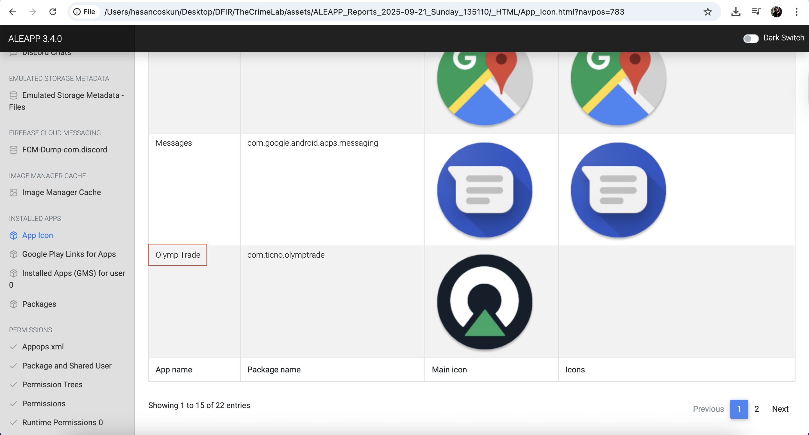
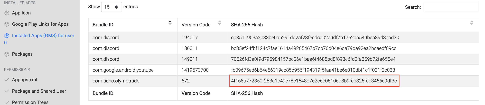
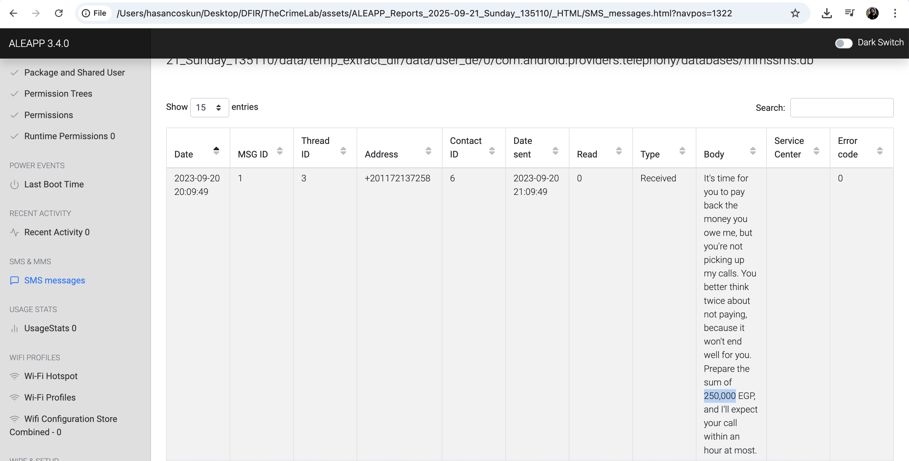
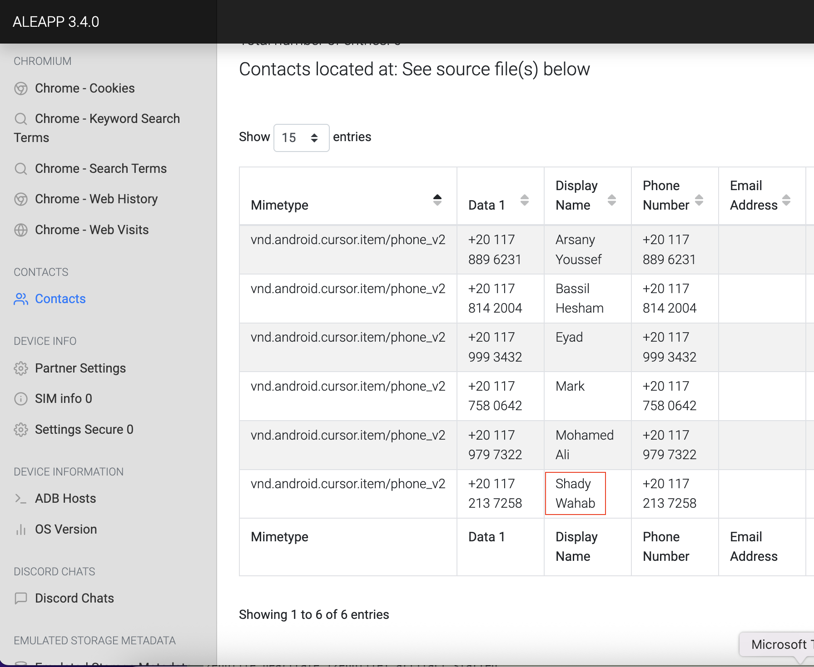
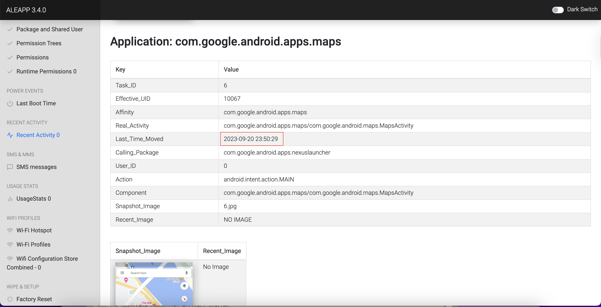
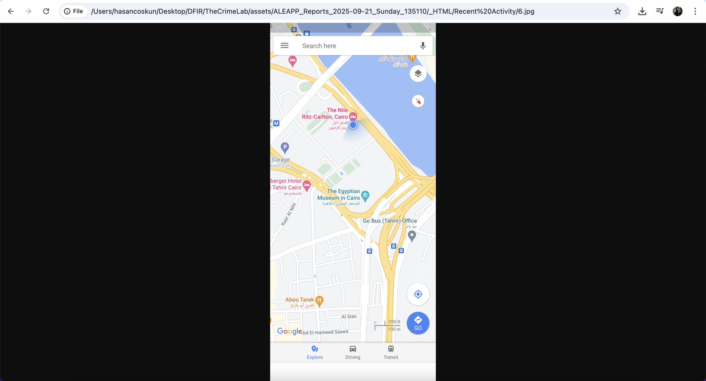
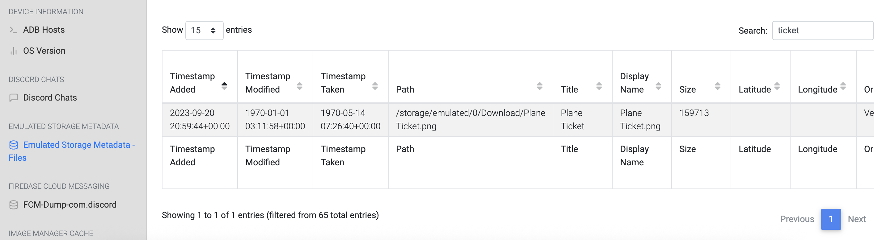
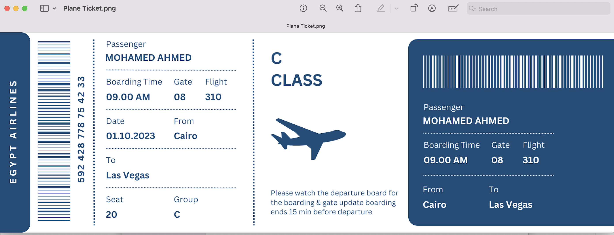
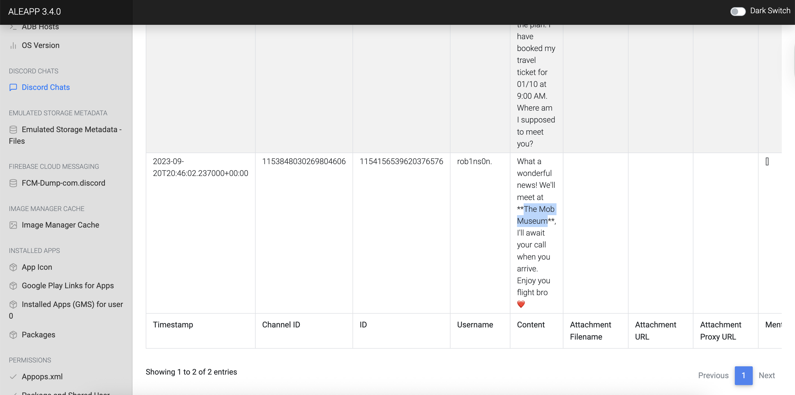

English ([README.en.md](README.en.md)) | Türkçe (bu sayfa)

# Vaka Analizi: The Crime Lab - Android Telefon Forensik Analizi

| Kategori | Açıklama |
| :--- | :--- |
| **Odak Alanı** | Android Telefon Forensik Analizi, Dijital Delil Analizi |
| **Delil** | `138-The-Crime.zip` (Android telefon verileri) |
| **Araçlar** | ALEAPP 3.4.0, DBeaver, SQLite |

---

## 1. Özet (Executive Summary)

Bu vaka, bir cinayet soruşturması kapsamında kurbanın Android telefonunun dijital forensik analizini içermektedir. Kurban, trading konusunda yoğun ilgi duyan ve bu nedenle borçlanan bir bireydir. 20 Eylül 2023 tarihinde evinden ayrılarak Kahire'deki The Nile Ritz-Carlton otelinde konaklamış ve Las Vegas'a seyahat etmeyi planlamıştır. Telefon analizi sonucunda kurbanın trading uygulaması (Olymp Trade), borç veren kişi (Shady Wahab), borç miktarı (250,000 EGP) ve Discord üzerinden The Mob Museum'da buluşma planı gibi kritik bilgiler tespit edilmiştir. ALEAPP 3.4.0 aracı kullanılarak Android telefon verileri başarıyla analiz edilmiş ve soruşturmaya yön veren önemli deliller elde edilmiştir.

---

## 2. Teknik Analiz (Hipotez Odaklı)
Her fazda hipotez → test → bulgu; görseller `Assets/` altında.

### Faz 1 — Android Telefon Verilerinin Hazırlanması
- **Hipotez**: Kurbanın Android telefonundan çıkarılan veriler trading aktiviteleri, borç ilişkileri ve seyahat planları hakkında bilgi içerebilir
- **Araç**: ALEAPP 3.4.0 (Android Logs Events and Protobuf Parser)
- **Komut**: `python3 aleappGUI.py`
- **Bulgular**: Android telefon verileri başarıyla analiz edildi ve web tabanlı rapor oluşturuldu

### Faz 2 — Trading Uygulamasının Tespiti (Q1)
- **Hipotez**: Kurban trading ile ilgilendiği için telefonunda trading uygulamaları bulunmalı
- **Analiz**: ALEAPP raporunda "Installed Apps (GMS) for user 0" bölümü incelendi
- **Bulgular**: Olymp Trade uygulaması tespit edildi
  - **Package Name**: com.ticno.olymptrade
  - **SHA-256**: `4f168a772350f283a1c49e78c1548d7c2c6c05106d8b9feb825fdc3466e9df3c`

### Faz 3 — Borç İlişkisinin Analizi (Q2 & Q3)
- **Hipotez**: Kurban borç aldığı kişi ile SMS üzerinden iletişim kurmuş olabilir
- **Analiz**: ALEAPP raporunda "SMS messages" bölümü incelendi
- **Bulgular**: 
  - **Borç Miktarı**: 250,000 EGP
  - **Borç Veren Kişi**: Shady Wahab (+201172137258)
  - **Mesaj İçeriği**: "It's time for you to pay back the money you owe me... Prepare the sum of 250,000 EGP"

### Faz 4 — Konum Analizi (Q4)
- **Hipotez**: 20 Eylül 2023 tarihinde kurbanın konumu Google Maps aktivitesinden tespit edilebilir
- **Analiz**: ALEAPP raporunda "Recent Activity" bölümü incelendi
- **Bulgular**: 
  - **Tarih**: 2023-09-20 23:50:29
  - **Konum**: The Nile Ritz-Carlton, Kahire
  - **Uygulama**: Google Maps (com.google.android.apps.maps)

### Faz 5 — Seyahat Planının Tespiti (Q5)
- **Hipotez**: Kurban uçak biletini telefonunda saklamış olabilir
- **Analiz**: ALEAPP raporunda "Emulated Storage Metadata - Files" bölümünde "ticket" araması yapıldı
- **Bulgular**: 
  - **Dosya**: Plane Ticket.png
  - **Tarih**: 2023-09-20 20:59:44
  - **Hedef**: Las Vegas (Cairo → Las Vegas)
  - **Uçuş**: Egypt Airlines, 01.10.2023, 09:00 AM

### Faz 6 — Discord İletişim Analizi (Q6)
- **Hipotez**: Kurban Discord üzerinden arkadaşları ile buluşma planları yapmış olabilir
- **Analiz**: ALEAPP raporunda "Discord Chats" bölümü incelendi
- **Bulgular**: 
  - **Buluşma Yeri**: The Mob Museum
  - **Tarih**: 2023-09-20T20:46:02
  - **Mesaj**: "We'll meet at The Mob Museum, I'll await your call when you arrive"

---

## 3. Soruşturma Sonuçları

### Q1: Trading Uygulamasının SHA256'ı
**Cevap**: `4f168a772350f283a1c49e78c1548d7c2c6c05106d8b9feb825fdc3466e9df3c`
- **Uygulama**: Olymp Trade (com.ticno.olymptrade)
- **Tespit Yöntemi**: ALEAPP "Installed Apps" bölümü

### Q2: Borç Miktarı
**Cevap**: 250,000 EGP
- **Kaynak**: SMS mesajı (+201172137258 numarasından)
- **Tarih**: 2023-09-20 20:09:49

### Q3: Borç Veren Kişinin Adı
**Cevap**: Shady Wahab
- **Telefon**: +201172137258
- **Kaynak**: Kişi listesi ve SMS mesajları

### Q4: 20 Eylül 2023'teki Konum
**Cevap**: The Nile Ritz-Carlton
- **Tarih**: 2023-09-20 23:50:29
- **Kaynak**: Google Maps aktivite geçmişi

### Q5: Seyahat Hedefi
**Cevap**: Las Vegas
- **Uçuş**: Egypt Airlines, 01.10.2023, 09:00 AM
- **Kaynak**: Uçak bileti (Plane Ticket.png)

### Q6: Discord Buluşma Yeri
**Cevap**: The Mob Museum
- **Tarih**: 2023-09-20T20:46:02
- **Kaynak**: Discord mesaj geçmişi

---

## 4. Sonuç ve Değerlendirme

Bu Android telefon forensik analizi, cinayet soruşturması kapsamında kurbanın dijital ayak izlerini başarıyla ortaya çıkarmıştır. ALEAPP 3.4.0 aracı kullanılarak yapılan analiz sonucunda:

- **Trading Aktivitesi**: Kurbanın Olymp Trade uygulamasını kullandığı ve bu nedenle borçlandığı tespit edilmiştir
- **Borç İlişkisi**: Shady Wahab'dan 250,000 EGP borç aldığı ve ödeme konusunda baskı gördüğü belirlenmiştir
- **Seyahat Planları**: Las Vegas'a seyahat etmeyi planladığı ve The Mob Museum'da buluşma ayarladığı ortaya çıkmıştır
- **Konum Verileri**: 20 Eylül 2023 tarihinde The Nile Ritz-Carlton otelinde konakladığı doğrulanmıştır

Bu bulgular, soruşturmanın yönünü belirlemede kritik rol oynamış ve kurbanın son günlerindeki aktivitelerini net bir şekilde ortaya koymuştur.
