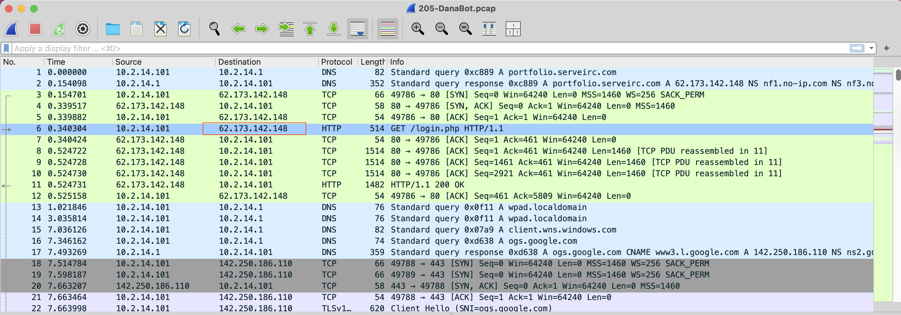
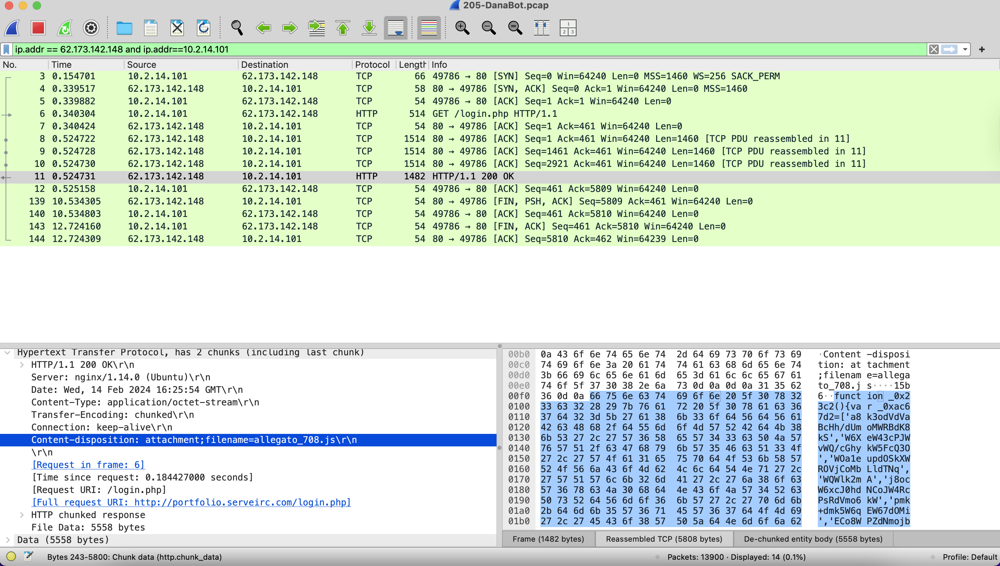
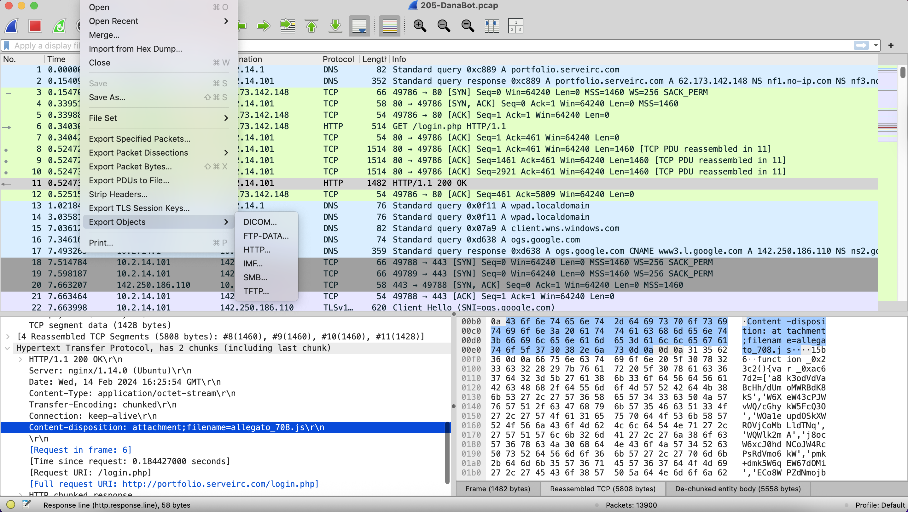
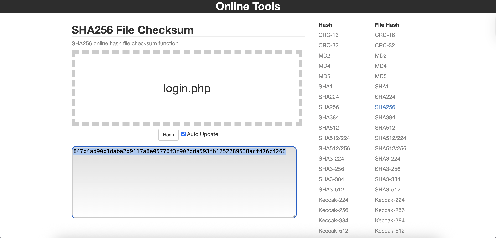
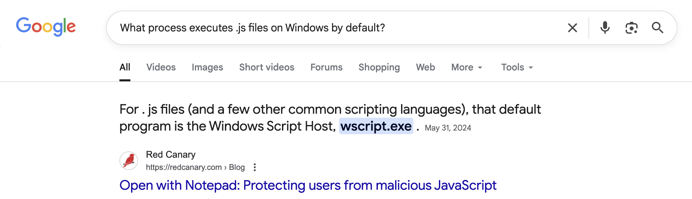
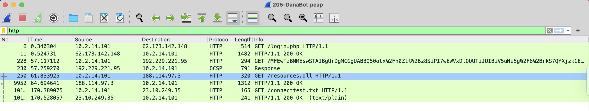
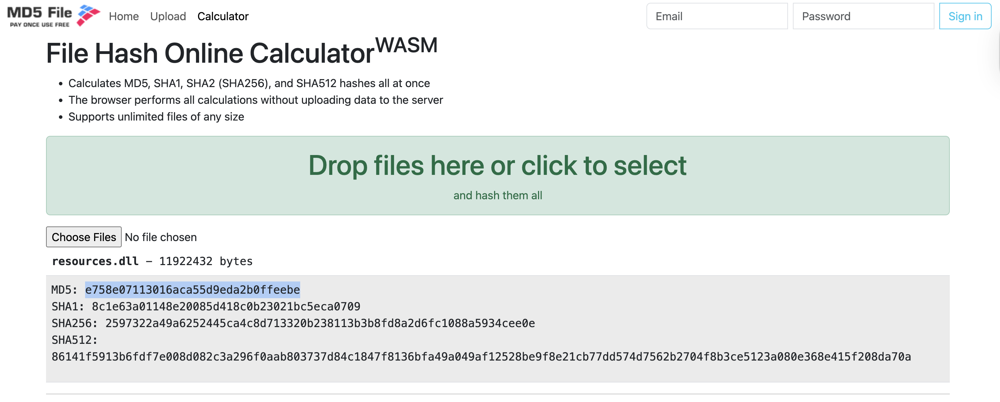

[Türkçe](README.md) | English (this page)

# Case Study: DanaBot - Network Forensics Analysis

| Category | Details |
| :--- | :--- |
| Focus | Network Forensics, Malware Analysis, PCAP Analysis |
| Evidence | `205-DanaBot.pcap` (Network Capture) |
| Tooling | Wireshark, Online Hash Calculator, Google Search |

---

## 1. Executive Summary

This case involves the analysis of suspicious network traffic detected by the SOC team. The victim machine (10.2.14.101) connected to an attacker's server (62.173.142.148) and downloaded malicious files. Initially, a JavaScript file (`allegato_708.js`) was downloaded and executed using `wscript.exe`. Subsequently, a larger DLL file (`resources.dll`) was downloaded to compromise the system. The attack was carried out over HTTP protocol and established C2 server communication through TLS encrypted traffic. PCAP analysis using Wireshark successfully identified all attack steps and calculated hash values of the malicious files.

---

## 2. Technical Analysis (Hypothesis‑Driven)
Per phase: hypothesis → test → finding. Images live under `assets/`.

### Phase 1 — Initial Access Analysis (Q1)
- **Hypothesis**: If we find the IP address used for initial access, we can identify the attacker's IP
- **Analysis**: DNS queries and HTTP traffic in PCAP file were examined
- **Findings**: 
  - **DNS Query**: `portfolio.serveirc.com` → `62.173.142.148`
  - **Attacker IP**: `62.173.142.148`
  - **Victim IP**: `10.2.14.101`

### Phase 2 — Malicious File Detection (Q2)
- **Hypothesis**: A malicious file must have been downloaded during initial access
- **Analysis**: HTTP responses and Content-Disposition headers were examined
- **Findings**:
  - **File Name**: `allegato_708.js`
  - **Content-Type**: `application/octet-stream`
  - **Content-Disposition**: `attachment;filename=allegato_708.js`

### Phase 3 — File Hash Analysis (Q3)
- **Hypothesis**: The malicious file's SHA-256 hash value can be calculated
- **Analysis**: File was exported from Wireshark and online hash calculator was used
- **Findings**:
  - **SHA-256**: `847b4ad90b1daba2d9117a8e05776f3f902dda593fb1252289538acf476c4268`
  - **File Size**: 5558 bytes

### Phase 4 — Process Analysis (Q4)
- **Hypothesis**: The JavaScript file must have been executed by a specific process
- **Analysis**: Network traffic and port analysis were performed
- **Findings**:
  - **Process**: `wscript.exe` (Windows Script Host)
  - **Reason**: .js files are executed by wscript.exe by default on Windows
  - **Port Analysis**: Continuous data transfer on port 49788

### Phase 5 — Second Malicious File Detection (Q5)
- **Hypothesis**: We can find the attacker's second malicious file in HTTP requests
- **Analysis**: HTTP traffic was filtered to examine all file transfers
- **Findings**:
  - **File Name**: `resources.dll`
  - **File Extension**: `.dll`
  - **Target IP**: `188.114.97.3`

### Phase 6 — Second File Hash Analysis (Q6)
- **Hypothesis**: The MD5 hash value of the second malicious file exported from File tab can be calculated
- **Analysis**: Online hash calculator was used to compute MD5 hash
- **Findings**:
  - **MD5**: `e758e07113016aca55d9eda2b0ffeebe`
  - **File Size**: 11922432 bytes
  - **File Type**: Dynamic Link Library (DLL)

---

## 3. Investigation Results

### Q1: Attacker IP Address
**Answer**: `62.173.142.148`
- **Domain**: portfolio.serveirc.com
- **Detection Method**: DNS query analysis

### Q2: First Malicious File
**Answer**: `allegato_708.js`
- **Content-Type**: application/octet-stream
- **Content-Disposition**: attachment;filename=allegato_708.js
- **File Size**: 5558 bytes

### Q3: First File's SHA-256 Hash
**Answer**: `847b4ad90b1daba2d9117a8e05776f3f902dda593fb1252289538acf476c4268`
- **Calculation Method**: Online hash calculator
- **File**: allegato_708.js

### Q4: Process Used to Execute Malicious File
**Answer**: `wscript.exe`
- **Reason**: .js files are executed by wscript.exe by default on Windows
- **Detection Method**: Port analysis and file extension analysis

### Q5: Second Malicious File Extension
**Answer**: `.dll`
- **File Name**: resources.dll
- **File Type**: Dynamic Link Library
- **Target IP**: 188.114.97.3

### Q6: Second File's MD5 Hash
**Answer**: `e758e07113016aca55d9eda2b0ffeebe`
- **Calculation Method**: Online hash calculator
- **File**: resources.dll
- **File Size**: 11922432 bytes

---

## 4. Critical Findings and IOCs

| Category | Value |
|---|---|
| **Attacker IP** | 62.173.142.148 |
| **Victim IP** | 10.2.14.101 |
| **Domain** | portfolio.serveirc.com |
| **First Malicious File** | allegato_708.js |
| **First File SHA-256** | 847b4ad90b1daba2d9117a8e05776f3f902dda593fb1252289538acf476c4268 |
| **Process** | wscript.exe |
| **Second Malicious File** | resources.dll |
| **Second File MD5** | e758e07113016aca55d9eda2b0ffeebe |
| **Protocol** | HTTP/HTTPS |
| **Port** | 80, 443 |

---

## 5. Conclusion and Assessment

This network forensics analysis successfully revealed the attack methodology of the DanaBot malware family. The attacker tricked the victim machine into downloading malicious files through a fake website. Initially, a JavaScript file (`allegato_708.js`) was downloaded and executed using Windows Script Host (`wscript.exe`). Subsequently, a larger DLL file (`resources.dll`) was downloaded to compromise the system.

The attack was carried out over HTTP protocol and established C2 server communication through TLS encrypted traffic. PCAP analysis using Wireshark successfully identified all attack steps and calculated hash values of the malicious files. This analysis provides critical information for detecting and preventing similar attacks.
