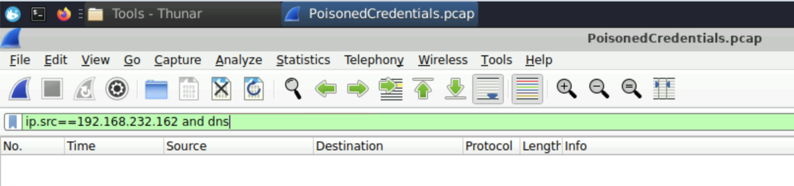
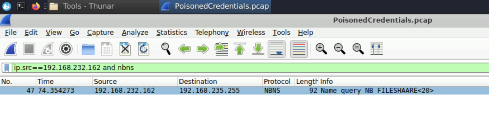
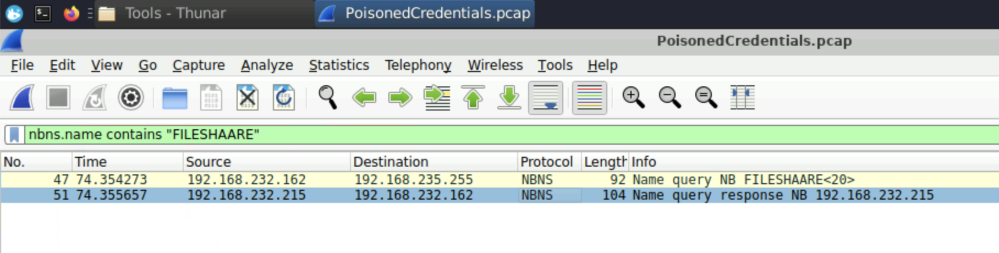
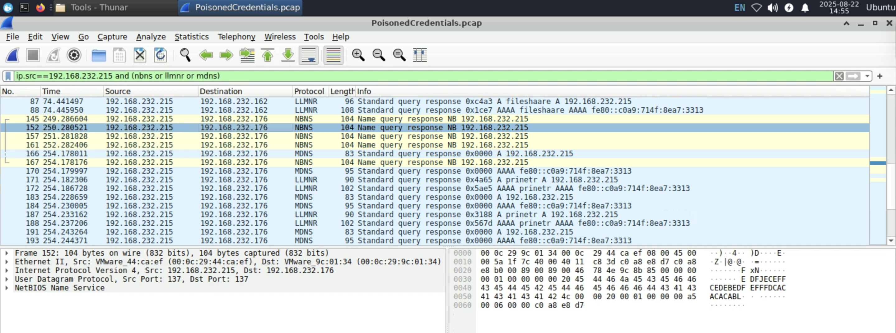
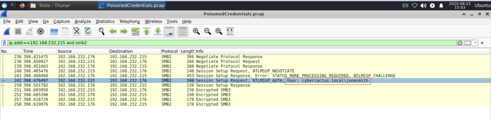
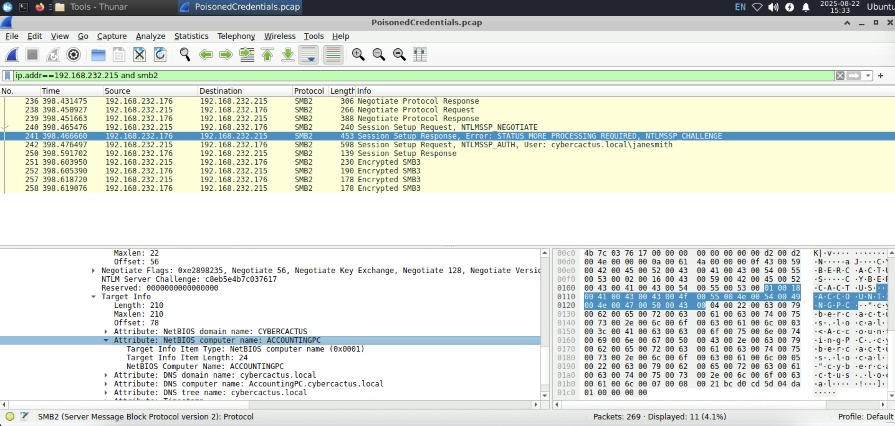

# Zehirli Kimlik Bilgileri: Bir Ağ Adli Bilişim Vakasının Anatomisi

Merhaba siber güvenlik meraklıları! Bu yazıda, CyberDefenders platformunda yer alan ve ağ adli bilişim (network forensics) becerilerini test eden "PoisonedCredentials" vakasını adım adım çözeceğiz. Tek bir kanıtla, bir `.pcap` dosyasıyla başlayarak, bir saldırganın yerel ağdaki basit bir yazım hatasından nasıl faydalanıp kritik bir sunucuya erişim sağladığını ortaya çıkaracağız. Aracımız ise ağ analistlerinin vazgeçilmezi olan **Wireshark**.

Hazırsanız, filtrelerimizi hazırlayalım ve bu siber saldırının izini sürmeye başlayalım!

## Olay Yeri: İlk İpuçları ve Analiz Ortamı

Elimizdeki tek delil, bir ağ trafiği kaydı olan `PoisonedCredentials.pcap` dosyası. Amacımız, bu trafikteki anormal aktiviteleri tespit ederek saldırının tüm aşamalarını yeniden inşa etmek.

---

## Soru 1: Olayı Başlatan Hatalı Sorgu

> **Soru:** In the context of the incident described in the scenario, the attacker initiated their actions by taking advantage of benign network traffic from legitimate machines. Can you identify the specific mistyped query made by the machine with the IP address 192.168.232.162?

### Analitik Yaklaşım

"Hatalı yazılmış sorgu" (mistyped query) ifadesi, genellikle bir kullanıcının bir sunucu veya web sitesi adını yanlış yazmasıyla başlar. Bir analist olarak ilk hipotezimiz, bunun bir DNS sorgusu olabileceğidir. Wireshark filtrelerini kullanarak `192.168.232.162` IP adresinden kaynaklanan DNS trafiğini inceleyerek işe başlarız.

### Kanıtları İnceleme

İlk olarak, standart DNS trafiğini ararız:
`ip.src==192.168.232.162 and dns`

Bu filtrenin boş dönmesi, hipotezimizin yanlış olduğunu gösterir. Saldırı, standart internet DNS'i üzerinden gerçekleşmemiştir. Bu durumda, Windows'un yerel ağ isim çözümleme mekanizmalarına yöneliriz: **NBNS (NetBIOS Name Service)**.

Filtremizi `nbns` olarak güncellediğimizde, aradığımız kanıt ortaya çıkar:
`ip.src==192.168.232.162 and nbns`

Görseldeki 47. paketin "Info" sütununda `Name query NB FILESHAARE<20>` ifadesini görüyoruz. Meşru bir dosya sunucusu olan "fileshare" isminin, fazladan bir "a" harfi eklenerek **"fileshaare"** şeklinde yanlış yazıldığı açıktır. Bu, saldırının başlangıç noktasıdır.

**✅ Cevap:** `fileshaare`

---

## Soru 2: Sahte (Rogue) Makinenin IP Adresi

> **Soru:** We are investigating a network security incident. To conduct a thorough investigation, We need to determine the IP address of the rogue machine. What is the IP address of the machine acting as the rogue entity?

### Analitik Yaklaşım

Bir önceki adımda kurbanın yanlışlıkla "fileshaare" diye sorduğunu bulduk. Şimdi "Ben fileshaare'yim!" diye sahte cevap veren saldırganı bulmalıyız. Bunun için, içinde "FILESHAARE" geçen tüm NBNS konuşmalarını filtrelemeliyiz.

### Kanıtları İnceleme

Aşağıdaki filtreyi kullanarak hem soruyu hem de cevabı aynı anda görebiliriz:
`nbns.name contains "FILESHAARE"`

Bu ekran görüntüsü, olayın tam kalbini gösteriyor:
- **Paket 47:** Kaynağı `192.168.232.162` (kurban) olan bir **soru (query)**.
- **Paket 51:** Kaynağı `192.168.232.215` olan bir **cevap (response)**.

Soruya cevap veren paketin kaynak IP adresi, kendini meşru sunucu gibi tanıtan sahte (rogue) makinedir.

**✅ Cevap:** `192.168.232.215`

---

## Soru 3: Etkilenen İkinci Makinenin IP Adresi

> **Soru:** As part of our investigation, identifying all affected machines is essential. What is the IP address of the second machine that received poisoned responses from the rogue machine?

### Analitik Yaklaşım

Artık saldırganın kimliğini (`192.168.232.215`) biliyoruz. Şimdi olayın kapsamını belirlemek için, bu saldırganın başka kimlere sahte cevaplar gönderdiğini bulmalıyız. Filtremizi, kaynağı saldırgan olan tüm yerel ağ isim çözümleme cevaplarını gösterecek şekilde ayarlayacağız.

### Kanıtları İnceleme

Filtremiz: `ip.src == 192.168.232.215 and (nbns or llmnr or mdns)`

Bu filtrenin çıktısında, "Destination" (Hedef) sütununu inceliyoruz. Saldırganın hem ilk kurban olan `192.168.232.162`'ye hem de **farklı bir IP adresi olan `192.168.232.176`'ya** sahte cevaplar gönderdiğini görüyoruz. Bu, saldırıdan etkilenen ikinci makinedir.

**✅ Cevap:** `192.168.232.176`

---

## Soru 4: Ele Geçirilen Kullanıcı Hesabı

> **Soru:** We suspect that user accounts may have been compromised. To assess this, we must determine the username associated with the compromised account. What is the username of the account that the attacker compromised?

### Analitik Yaklaşım

Kurban makineler, saldırganı meşru bir dosya sunucusu sandıkları için, ona bağlanmak amacıyla kimlik bilgilerini göndermeye çalışacaklardır. Bu kimlik doğrulama trafiği, Windows ağlarında **SMB2** protokolü üzerinden gerçekleşir. Kullanıcı adını bulmak için bu SMB2 konuşmasını incelemeliyiz.

### Kanıtları İnceleme

Saldırgan ve kurbanlar arasındaki tüm SMB2 trafiğini izole etmek için şu filtreyi kullanıyoruz:
`(ip.addr == 192.168.232.215) and smb2`

Filtrelenmiş trafikte, **Paket 242**'nin "Info" sütununda `Session Setup Request, NTLMSSP_AUTH, User: cybercactus.local\janesmith` ifadesi yer alıyor. Bu, `janesmith` adlı kullanıcının, `cybercactus.local` etki alanındaki kimlik bilgilerini kullanarak oturum açmaya çalıştığı andır. Bu paketle birlikte, saldırgan bu kullanıcının kimlik bilgilerini ele geçirmiştir.

**✅ Cevap:** `janesmith`

---

## Soru 5: Saldırganın Eriştiği Makinenin Adı (Hostname)

> **Soru:** As part of our investigation, we aim to understand the extent of the attacker's activities. What is the hostname of the machine that the attacker accessed via SMB?

### Analitik Yaklaşım

Saldırgan, `janesmith` kullanıcısının kimlik bilgilerini çaldıktan sonra, bu bilgileri ağda yanal olarak hareket etmek (lateral movement) için kullanacaktır. Amacımız, saldırganın bu çalıntı kimlik bilgileriyle hangi hedef makineye bağlandığını bulmaktır. Hedef makine, SMB konuşmasının başlangıcında, "Negotiate Protocol Response" veya "Session Setup Response" paketlerinde kendi kimliğini (hostname) belirtir.

### Kanıtları İnceleme

Bir önceki soruda kullandığımız filtreyi (`... and smb2`) kullanarak konuşmayı incelemeye devam ediyoruz. **Paket 241**'e, yani hedef makinenin (`192.168.232.176`) saldırgana gönderdiği "Session Setup Response" paketine odaklanıyoruz.

Paket detaylarını incelediğimizde, `NTLMSSP_CHALLENGE` mesajının içindeki **Target Info** bölümünde, hedef makinenin kendisi hakkında verdiği bilgileri görüyoruz:
- `Attribute: NetBIOS computer name: ACCOUNTINGPC`
- `Attribute: NetBIOS domain name: CYBERCACTUS`

Bu, saldırganın çalıntı kimlik bilgileriyle erişim sağladığı makinenin adının **ACCOUNTINGPC** olduğunu kesin olarak kanıtlar.

**✅ Cevap:** `ACCOUNTINGPC`

---

## Sonuç: Saldırı Zincirinin Tamamı

Tek bir `.pcap` dosyasından yola çıkarak, klasik bir "Name Poisoning" saldırısının tüm adımlarını başarıyla yeniden inşa ettik:

1. **Başlangıç:** Bir kullanıcı, `fileshare` yerine yanlışlıkla `fileshaare` yazar.
2. **Zehirleme:** Saldırgan (`192.168.232.215`), bu yanlış sorguya cevap vererek kurbanları (`.162` ve `.176`) kendi üzerine yönlendirir.
3. **Kimlik Hırsızlığı:** Kurban makineler, `janesmith` kullanıcısının kimlik bilgilerini (parola hash'i) saldırgana gönderir.
4. **Yanal Hareket:** Saldırgan, bu çalıntı kimlik bilgilerini kullanarak ağdaki kritik bir hedef olan `ACCOUNTINGPC` sunucusuna erişim sağlar.

Bu vaka, ağ trafiği analizinin bir siber olayın aydınlatılmasında ne kadar güçlü bir araç olduğunu ve doğru filtrelerle en karmaşık görünen trafik kayıtlarının bile bir hikaye anlatabileceğini göstermektedir.

---

## Teknik Detaylar ve Öğrenilen Dersler

### Kullanılan Wireshark Filtreleri
- `ip.src==192.168.232.162 and dns` - DNS trafiği arama
- `ip.src==192.168.232.162 and nbns` - NBNS trafiği arama
- `nbns.name contains "FILESHAARE"` - Hatalı sorgu analizi
- `ip.src == 192.168.232.215 and (nbns or llmnr or mdns)` - Saldırgan trafiği
- `(ip.addr == 192.168.232.215) and smb2` - SMB2 kimlik doğrulama trafiği

### Protokol Detayları
- **NBNS (NetBIOS Name Service):** Windows yerel ağ isim çözümleme
- **LLMNR (Link-Local Multicast Name Resolution):** Windows Vista+ isim çözümleme
- **MDNS (Multicast DNS):** Yerel ağ DNS alternatifi
- **SMB2:** Windows dosya paylaşım protokolü
- **NTLMSSP:** Windows kimlik doğrulama protokolü

### Güvenlik Önlemleri
1. **DNS Güvenliği:** DNSSEC kullanımı
2. **Ağ Segmentasyonu:** Kritik sistemleri izole etme
3. **İzleme ve Uyarı:** Anormal NBNS/LLMNR trafiği tespiti
4. **Kullanıcı Eğitimi:** Doğru sunucu adı yazımı
5. **Endpoint Güvenliği:** Gelişmiş tehdit koruması

---

*Bu yazı, siber güvenlik eğitimi amaçlı hazırlanmıştır. Her analiz, kendine özgü detaylar ve zorluklar içerir. Gerçek vakalarda benzer teknikler kullanılarak siber saldırılar tespit edilir ve önlenir.*
