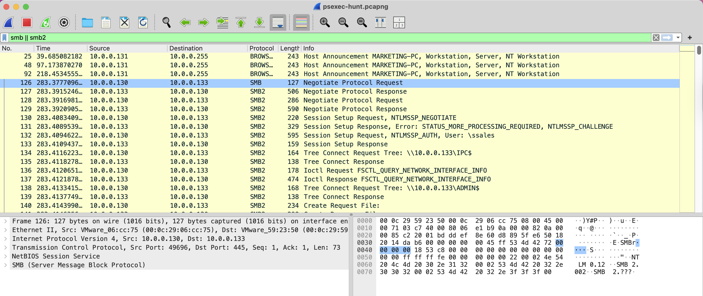
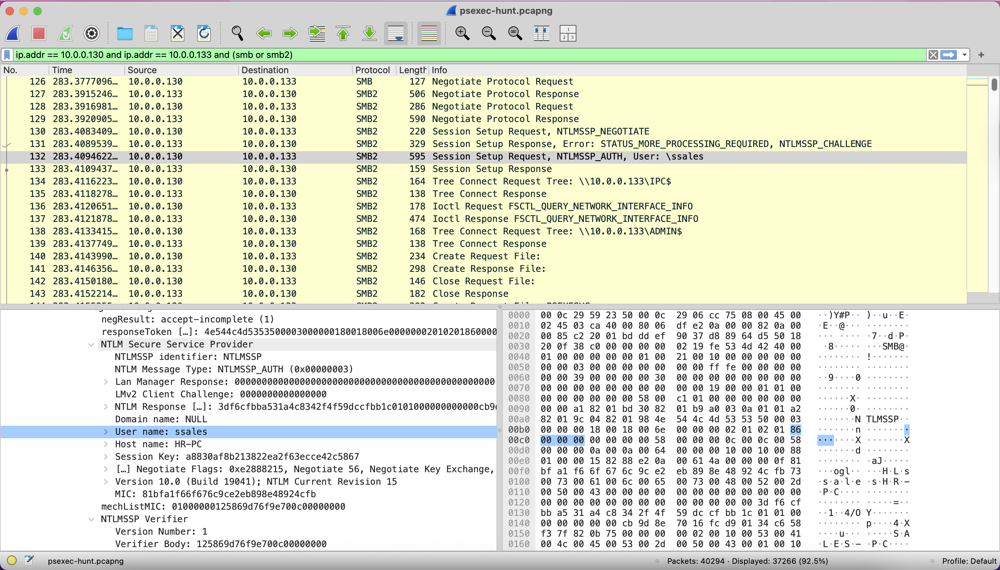
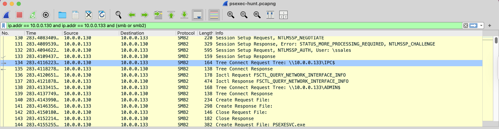

[Türkçe](README.md) | English (this page)

# Case Study: PsExec Hunt

| Category | Details |
| :--- | :--- |
| **Focus Area** | Network Forensics, Lateral Movement Analysis, PsExec Investigation |
| **Evidence** | `psexec-hunt.pcapng` (Network Capture, 40,294 packets) |
| **Tooling** | Wireshark, SMB/SMB2 Protocol Analysis, NTLM Authentication Analysis |
| **Level** | Easy |
| **Duration** | 30 minutes |
| **Category** | Network Forensics |
| **Tactics** | Execution, Defense Evasion, Discovery, Lateral Movement |

---

## 1. Executive Summary

This case study presents a network forensics investigation of a **PsExec lateral movement** attack within a corporate network. The attacker, starting from IP address **10.0.0.130**, successfully pivoted to **SALES-PC (10.0.0.133)** and **MARKETING-PC (10.0.0.131)** machines sequentially. Using the **ssales** user account, the attacker deployed **PSEXESVC.exe** service executable via SMB protocol and gained remote command execution privileges. The attack utilized **ADMIN$** and **IPC$** network shares and was detected in a PCAP file containing **40,294 packets**. This lateral movement activity demonstrates evidence of a **multi-target attack** within the corporate network and reveals significant **privilege escalation** risks.

---

## 2. Technical Analysis (Network Forensics Focused)
Each phase follows: hypothesis → test → finding; images are provided below.

### Phase 1 — Attacker's Initial Access Point Identification
- **Hypothesis:** We can identify the attacker's initial access IP address from SMB Negotiate Protocol Request packets
- **Filter:** `smb || smb2`
- **Findings:** IP address 10.0.0.130 identified as the machine sending SMB Negotiate Protocol Request

**Analysis:** As shown in Packet 126, an "SMB Negotiate Protocol Request" was sent from IP address 10.0.0.130 to 10.0.0.133. In PsExec lateral movement, the attacker is the party initiating the first connection.

### Phase 2 — First Target Machine Hostname Identification
- **Hypothesis:** Target machine hostname can be found in NTLMSSP_CHALLENGE response packets
- **Filter:** `smb || smb2` (using existing filter)
- **Findings:** SALES-PC hostname identified in Target Name field of NTLMSSP_CHALLENGE response

**Analysis:** As shown in Packet 131, the NTLMSSP_CHALLENGE response contains "Target Name: SALES-PC" information. This is the hostname of the machine with IP address 10.0.0.133.

### Phase 3 — Attacker's Authentication Account Identification
- **Hypothesis:** Username used by the attacker can be found in NTLMSSP_AUTHENTICATE packets
- **Filter:** `ip.addr == 10.0.0.130 and ip.addr == 10.0.0.133 and (smb || smb2)`
- **Findings:** Username "ssales" identified in User name field of NTLMSSP_AUTHENTICATE packet

**Analysis:** As shown in Packet 132, the NTLMSSP_AUTHENTICATE request contains "User name: ssales" information. This is the account used by the attacker for authentication.

### Phase 4 — Service Executable Name Identification
- **Hypothesis:** PsExec's deployed service executable name can be found in SMB2 Create Request packets
- **Filter:** `ip.addr == 10.0.0.130 and ip.addr == 10.0.0.133 and (smb || smb2)`
- **Findings:** PSEXESVC.exe file identified in SMB2 Create Request packets

**Analysis:** As shown in Packet 144, a "Create Request File: PSEXESVC.exe" request was sent. This is the name of the service executable deployed by PsExec on the target machine.

### Phase 5 — Network Share for Service Installation Identification
- **Hypothesis:** Network share used for service installation can be found in SMB2 Tree Connect Request packets
- **Filter:** `ip.addr == 10.0.0.130 and ip.addr == 10.0.0.133 and (smb || smb2)`
- **Findings:** ADMIN$ share was used for service installation

**Analysis:** As shown in Packet 138, a "Tree Connect Request Tree: \\10.0.0.133\ADMIN$" request was sent. The ADMIN$ share was used to copy the PSEXESVC.exe file to the C:\Windows directory.

### Phase 6 — Network Share for Communication Identification
- **Hypothesis:** Network share used for communication can be found in SMB2 Tree Connect Request packets
- **Filter:** `ip.addr == 10.0.0.130 and ip.addr == 10.0.0.133 and (smb || smb2)`
- **Findings:** IPC$ share was used for communication

**Analysis:** As shown in Packet 134, a "Tree Connect Request Tree: \\10.0.0.133\IPC$" request was sent. The IPC$ share was used for service management and command execution.

### Phase 7 — Second Lateral Movement Target Identification

#### 7.1 — New Target IP Identification
- **Hypothesis:** We can identify new target IPs by excluding the first pivot traffic and analyzing Host Announcement packets
- **Filter:** `(smb || smb2) and not (ip.addr == 10.0.0.130 or ip.addr == 10.0.0.133)`
- **Findings:** IP address 10.0.0.131 identified as new lateral movement target from Host Announcement packets

#### 7.2 — Target Machine Hostname Identification
- **Hypothesis:** Similar to Q2, we can identify the target machine hostname in NTLMSSP_CHALLENGE response packets
- **Filter:** `ip.addr == 10.0.0.130 and ip.addr == 10.0.0.131 and (smb || smb2)`
- **Findings:** MARKETING-PC hostname identified in Target Name field of NTLMSSP_CHALLENGE response

**Analysis:** In Q7, we applied a two-stage analysis. First, we identified IP address 10.0.0.131 by excluding the first pivot traffic. In the second stage, we used the same method as Q2 to analyze SMB traffic between the attacker (10.0.0.130) and the second target machine (10.0.0.131), finding "Target Name: MARKETING-PC" information in NTLMSSP_CHALLENGE response packets. This is the same analysis method used in Q2 for SALES-PC identification and confirms the attacker's second lateral movement target.

---

## 3. Findings & IOCs
| Type | Value |
|---|---|
| **Attacker IP** | `10.0.0.130` |
| **First Target** | `10.0.0.133` (SALES-PC) |
| **Second Target** | `10.0.0.131` (MARKETING-PC) |
| **Compromised Account** | `ssales` |
| **Service Executable** | `PSEXESVC.exe` |
| **Network Shares** | `ADMIN$`, `IPC$` |
| **Protocols** | `SMB2`, `NTLMSSP`, `BROWS` |
| **Port** | `445` (SMB) |
| **Attack Vector** | `PsExec Lateral Movement` |

> **Notes:**
> - PsExec is Microsoft's official administrative tool (not malicious)
> - PSEXESVC.exe is PsExec's service component
> - ADMIN$ share maps to C:\Windows directory
> - IPC$ share is used for inter-process communication

---

## Appendix A — MITRE ATT&CK Mapping
- **T1021.002 (Remote Services: SMB/Windows Admin Shares)** — PsExec's use of ADMIN$ and IPC$ shares
- **T1055 (Process Injection)** — PSEXESVC.exe service executable execution on target machine
- **T1021.001 (Remote Services: Remote Desktop Protocol)** — Remote access via SMB protocol
- **T1078.002 (Valid Accounts: Domain Accounts)** — Use of ssales user account
- **T1021.003 (Remote Services: Distributed Component Object Model)** — DCERPC protocol usage
- **T1047 (Windows Management Instrumentation)** — Service management and command execution
