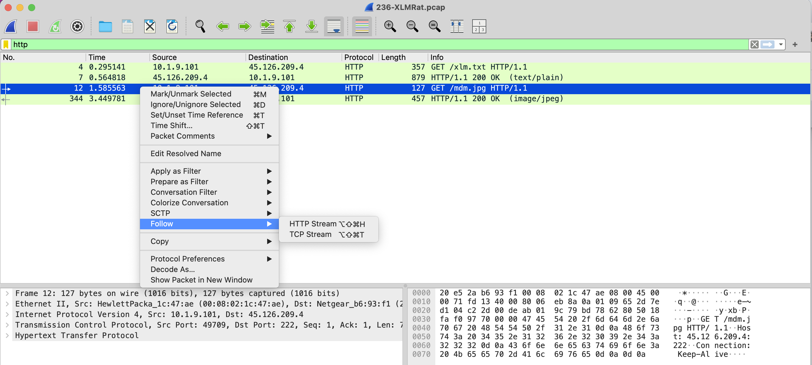
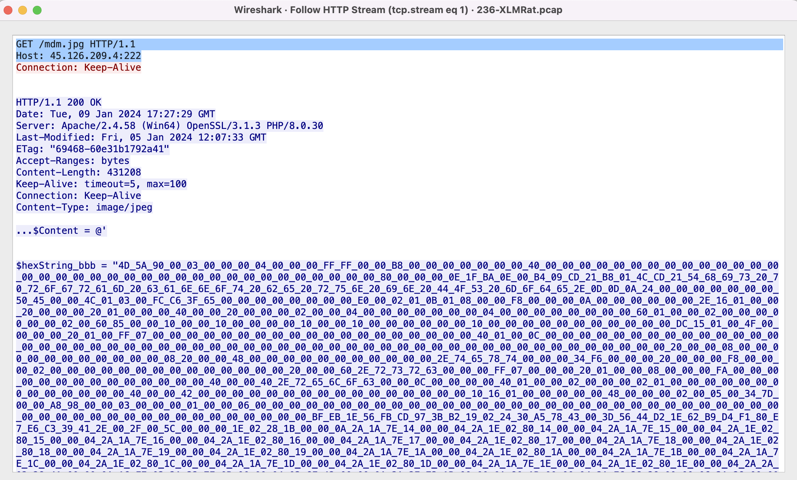
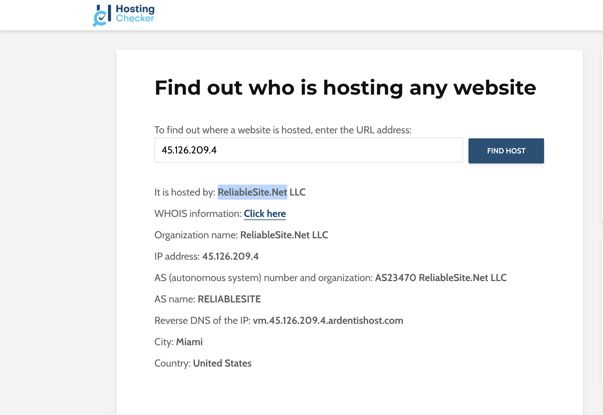
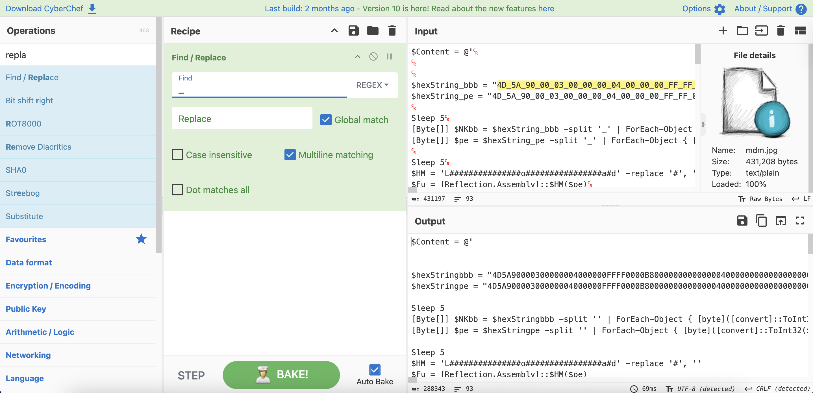
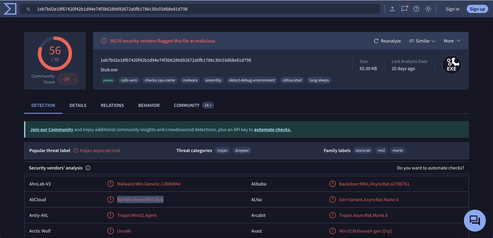
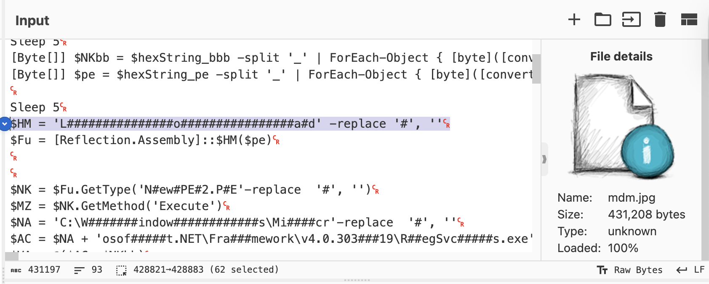
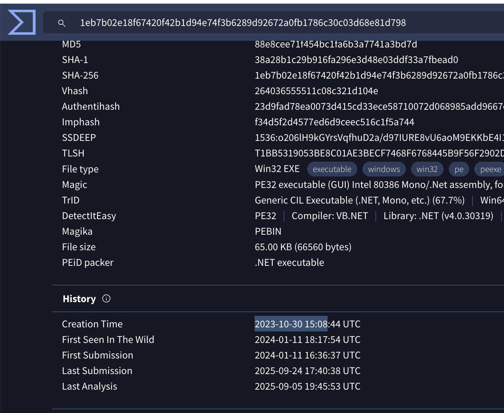
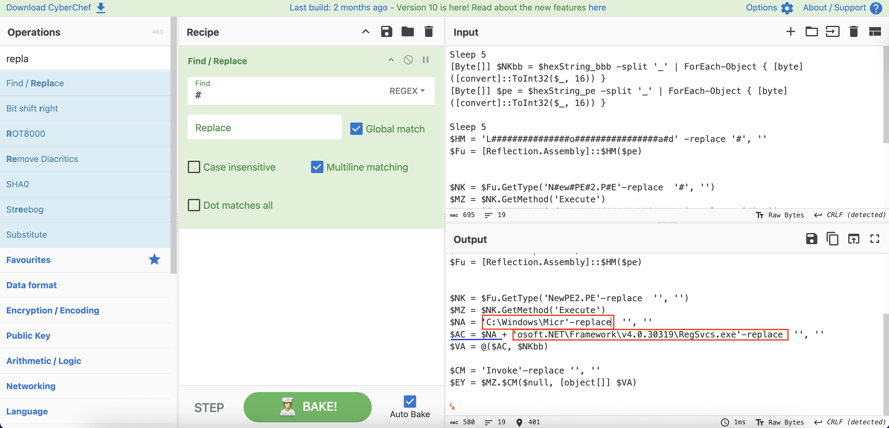
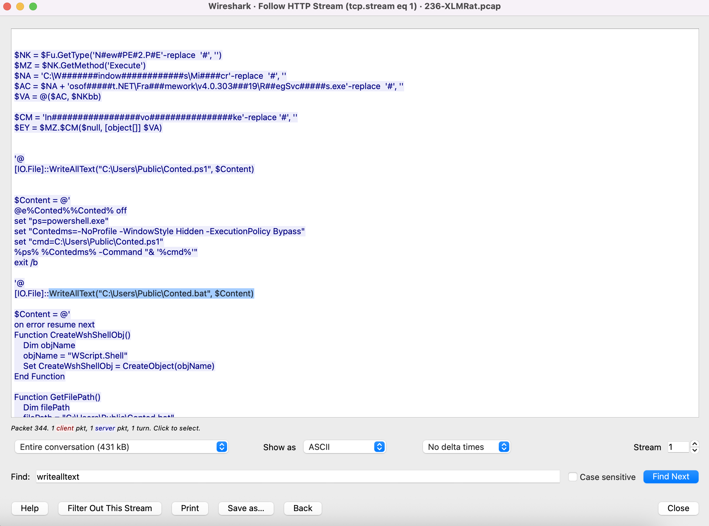

English (this page) | [Türkçe](README.md)

# Case Study: XLM-RAT - Network Forensics and Malware Analysis

| Category | Description |
| :--- | :--- |
| **Focus Area** | Network Forensics, Malware Analysis, PowerShell Obfuscation |
| **Evidence** | `236-XLMRat.pcap` (Network Capture) |
| **Tooling** | Wireshark, CyberChef, VirusTotal, Hosting Checker |

---

## 1. Executive Summary

This case involves the analysis of a machine flagged due to suspicious network traffic. The attacker used PowerShell scripts to download and execute XLM-RAT (AsyncRAT) family malware on the target system. The attack began with downloading a PowerShell script disguised as `mdm.jpg` from `45.126.209.4:222`, followed by executing a secondary payload through obfuscated code. Analysis revealed that the attacker used LOLBin techniques with `RegSvcs.exe` for stealthy process execution and dropped multiple files to establish persistence on the system.

---

## 2. Technical Analysis (Hypothesis-Driven)

Each phase follows hypothesis → test → findings; screenshots in `assets/` directory.

### Phase 1 — Initial Malware Download Analysis (Q1)
- **Hypothesis**: The attacker downloaded the first stage malware via HTTP traffic
- **Analysis**: HTTP traffic filtered in Wireshark to examine GET requests
- **Findings**: 
  - **Source IP**: `10.1.9.101` (Victim machine)
  - **Target IP**: `45.126.209.4:222`
  - **Downloaded File**: `mdm.jpg` (PowerShell script disguised as JPEG)
  - **Full URL**: `http://45.126.209.4:222/mdm.jpg`

### Phase 2 — Hosting Provider Identification (Q2)
- **Hypothesis**: The attacker's IP address should belong to a specific hosting provider
- **Analysis**: WHOIS query performed for IP address `45.126.209.4`
- **Findings**: 
  - **Hosting Provider**: `ReliableSite.Net LLC`
  - **Location**: Miami, USA
  - **AS Number**: AS23470

### Phase 3 — Malware Executable Hash Analysis (Q3)
- **Hypothesis**: The PowerShell script should contain a secondary payload embedded in hex format
- **Analysis**: Hex data from `$hexString_bbb` variable extracted and processed with CyberChef
- **Solution Approach**:
  1. **Hex Data Extraction**: Value of `$hexString_bbb` variable copied from PowerShell script
  2. **CyberChef Recipe Creation**:
     - **Find/Replace**: Remove `-` characters (Global match, REGEX)
     - **From Hex**: Convert hex string to binary format (Delimiter: Auto)
     - **SHA2**: Calculate SHA256 hash (Size: 256, Rounds: 64)
  3. **Anti-Forensics Detection**: `$hexString_bbb` variable selected to hide as "bb" file instead of PE
- **Findings**: 
  - **SHA-256**: `1eb7b02e18f67420f42b1d94e74f3b6289d92672a0fb1786c30c03d68e81d798`
  - **File Type**: PE32 Executable (.NET Assembly)
  - **Size**: 65.00 KB
  - **Anti-Forensics**: File name hidden as "bb" (instead of PE)

### Phase 4 — Malware Family Identification (Q4)
- **Hypothesis**: Obfuscated PowerShell code should contain signatures of a specific malware family
- **Analysis**: VirusTotal analysis and PowerShell code deobfuscation process
- **Solution Approach**:
  1. **VirusTotal Analysis**: SHA256 hash uploaded to VirusTotal for detailed analysis
  2. **PowerShell Deobfuscation**: Obfuscated strings cleaned with CyberChef
     - **Find/Replace**: Remove `#` characters (Global match, Multiline matching)
     - **Result**: `N#ew#PE#2.P#E` → `NewPE2.PE`, `L#o#a#d` → `Load`
  3. **Malware Family Detection**: Alibaba's `Backdoor:MSIL/AsyncRat.a2786761` label confirmed AsyncRAT family
- **Findings**: 
  - **Malware Family**: `AsyncRAT` (Alibaba label: `Backdoor:MSIL/AsyncRat.a2786761`)
  - **Obfuscated Strings**: `N#ew#PE#2.P#E` → `NewPE2.PE`, `L#o#a#d` → `Load`
  - **Detection Rate**: 56/70 security vendors
  - **Obfuscation Technique**: String masking with `#` character

### Phase 5 — Malware Creation Timestamp (Q5)
- **Hypothesis**: HTTP response headers should contain the file creation time
- **Analysis**: `Date` header in HTTP response packets examined
- **Findings**: 
  - **Creation Time**: `2023-10-30 15:08:44 UTC` (from VirusTotal)
  - **Download Time**: `Tue, 09 Jan 2024 17:27:29 GMT` (from HTTP response)

### Phase 6 — LOLBin Usage Analysis (Q6)
- **Hypothesis**: PowerShell script should abuse legitimate Windows tools for stealthy process execution
- **Analysis**: Deobfuscation process of obfuscated strings
- **Solution Approach**:
  1. **PowerShell Code Examination**: Obfuscated file path strings detected in script
  2. **CyberChef Deobfuscation**:
     - **Find/Replace**: Remove `#` characters (Global match, Multiline matching)
     - **Result**: `C:\W#######indow############s\Mi####cr` → `C:\Windows\Micr`
     - **Second Part**: `osof#####t.NET\Fra###mework\v4.0.303###19\R##egSvc#####s.exe` → `osoft.NET\Framework\v4.0.30319\RegSvcs.exe`
  3. **String Concatenation**: Two parts combined to create full path
- **Findings**: 
  - **LOLBin**: `RegSvcs.exe`
  - **Full Path**: `C:\Windows\Microsoft.NET\Framework\v4.0.30319\RegSvcs.exe`
  - **Usage Purpose**: Legitimate tool for registering .NET assemblies
  - **Anti-Forensics**: File path obfuscated and split into parts

### Phase 7 — Dropped Files Analysis (Q7)
- **Hypothesis**: PowerShell script should create multiple files for persistence
- **Analysis**: Analysis of `[IO.File]::WriteAllText` commands
- **Solution Approach**:
  1. **HTTP Stream Analysis**: Full PowerShell script content examined using `Follow HTTP Stream` in Wireshark
  2. **WriteAllText Commands Detection**: Three different `[IO.File]::WriteAllText` commands found in script
  3. **File Names Extraction**: File names and contents extracted from each command
  4. **File Types Analysis**: Each file identified as different script type
- **Findings**: 
  - **Dropped Files**: `Conted.ps1`, `Conted.bat`, `Conted.vbs`
  - **Target Directory**: `C:\Users\Public\`
  - **Purpose**: Persistence and chained execution
  - **Anti-Forensics**: File names obfuscated as "Conted" (instead of Content)

---

## 3. Investigation Results

### Q1: Initial Malware URL
**Answer**: `http://45.126.209.4:222/mdm.jpg`

**Analysis**: When examining HTTP traffic in Wireshark, it was observed that a `GET /mdm.jpg` request was sent from source IP `10.1.9.101` to target IP `45.126.209.4:222`. Analysis of the response packet revealed that this request received a `200 OK` response and contained PowerShell script content.

### Q2: Hosting Provider
**Answer**: `ReliableSite.Net`

**Analysis**: WHOIS query performed for IP address `45.126.209.4` revealed that the IP address belongs to `ReliableSite.Net LLC`.

### Q3: Malware Executable SHA256
**Answer**: `1eb7b02e18f67420f42b1d94e74f3b6289d92672a0fb1786c30c03d68e81d798`

**Analysis**: Hex data from the `$hexString_bbb` variable in the PowerShell script extracted from PCAP was processed with CyberChef to obtain the SHA256 hash value.

### Q4: Malware Family (Alibaba)
**Answer**: `AsyncRAT`

**Analysis**: VirusTotal analysis and PowerShell code deobfuscation process revealed that the malware belongs to the AsyncRAT family.

### Q5: Malware Creation Timestamp
**Answer**: `2023-10-30 15:08`

**Analysis**: The `Creation Time` value from VirusTotal file details was used.

### Q6: Used LOLBin
**Answer**: `C:\Windows\Microsoft.NET\Framework\v4.0.30319\RegSvcs.exe`

**Analysis**: Deobfuscation process of obfuscated strings in the PowerShell script revealed that `RegSvcs.exe` file was used.

### Q7: Dropped Files
**Answer**: `Conted.ps1,Conted.bat,Conted.vbs`

**Analysis**: When examining the `[IO.File]::WriteAllText` commands in the PowerShell script, it was observed that three different files were written to the `C:\Users\Public\` directory.

---

## 4. Critical Findings and IOCs

| Category | Value |
|---|---|
| **Attacker IP** | 45.126.209.4:222 |
| **Victim IP** | 10.1.9.101 |
| **Hosting Provider** | ReliableSite.Net LLC |
| **Malware Family** | AsyncRAT (XLM-RAT) |
| **SHA-256** | 1eb7b02e18f67420f42b1d94e74f3b6289d92672a0fb1786c30c03d68e81d798 |
| **LOLBin** | C:\Windows\Microsoft.NET\Framework\v4.0.30319\RegSvcs.exe |
| **Dropped Files** | Conted.ps1, Conted.bat, Conted.vbs |
| **Obfuscation Technique** | String replacement (# character) |

---

## 5. Conclusion and Assessment

This network forensics analysis revealed the sophisticated distribution of XLM-RAT (AsyncRAT) family malware. The attacker used PowerShell obfuscation techniques to hide their code and abused legitimate Windows tools (LOLBin) to make detection difficult.

**Key Findings:**
- PowerShell script disguised as JPEG file
- Secondary payload embedded in hex format
- Stealthy process execution using RegSvcs.exe
- Multi-file dropping strategy for persistence

**Security Recommendations:**
- Tightening PowerShell execution policies
- Monitoring LOLBin usage
- Detection of suspicious file extensions (scripts in JPEG)
- Analysis of hex payloads in network traffic

This case demonstrates how sophisticated modern malware uses anti-forensics techniques and highlights the critical importance of network forensics analysis.