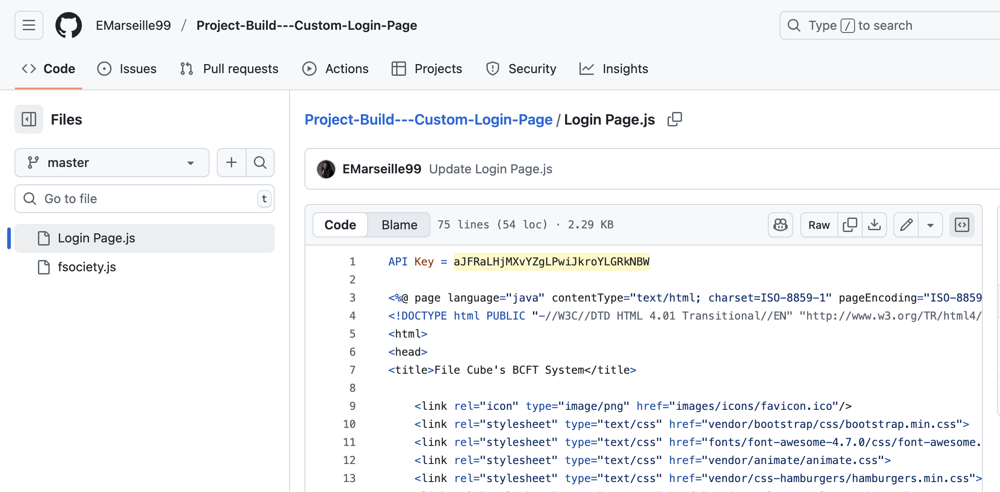
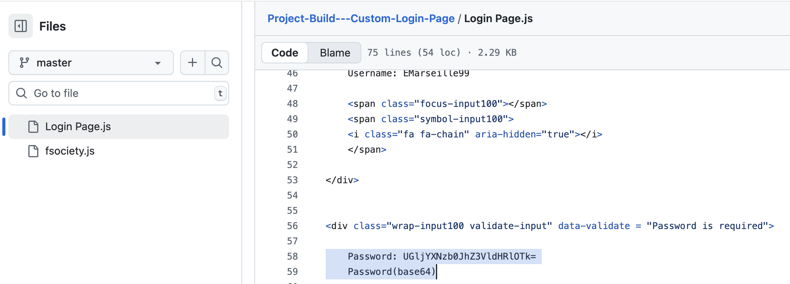
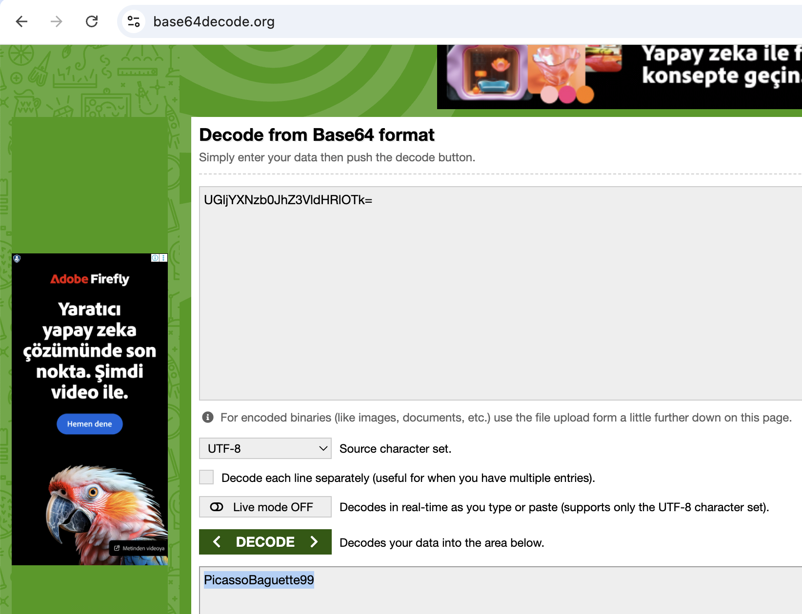
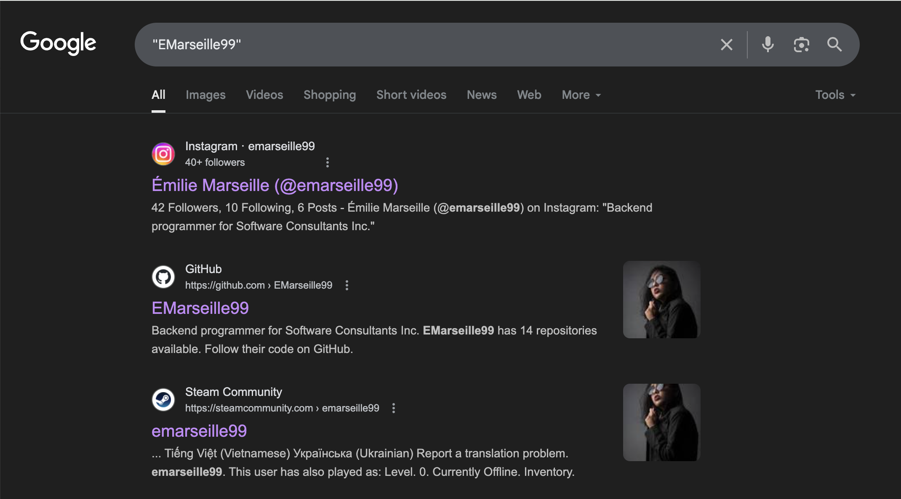
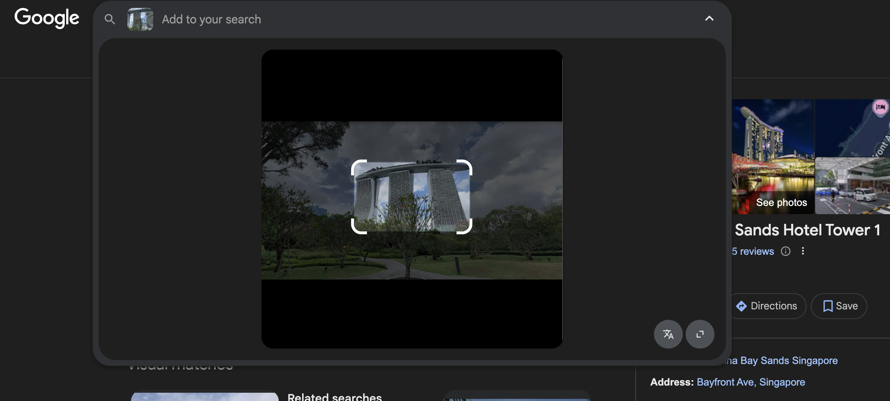
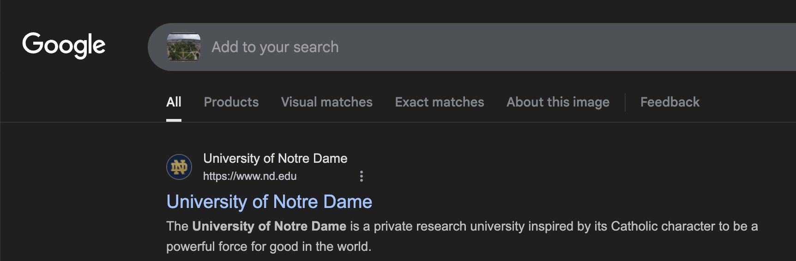

# Lespion: Bir İç Tehdit (Insider Threat) Vakasının OSINT Analizi

   

**Yazar:** Hasan Coşkun  
**Tarih:** 30 Ağustos 2025  
**Platform:** CyberDefenders  
**Vaka:** Lespion (OSINT Investigation)  
**Kategori:** Insider Threat Analysis

---

## 📋 **Vaka Özeti (Case Overview)**

Bu vaka, bir iç tehdit şüphelisinin dijital ayak izlerini OSINT (Open Source Intelligence) teknikleri kullanarak takip etmemizi gerektiriyor. Delillerimiz, bir çalışana ait olduğu düşünülen GitHub profili ve çeşitli görsellerden ibaret. Görevimiz, bu açık kaynakları kullanarak:

- 🔑 Sızdırılmış API anahtarlarını ve parolaları bulmak
- 🕵️ Şüphelinin online profillerini birbirine bağlamak  
- 🌍 Fiziksel konum tespiti yapmak
- 💰 Kaynak kötüye kullanımı kanıtlarını ortaya çıkarmak

---

## 🎯 **Delil Analizi (Evidence Analysis)**

### **Primary Evidence Sources:**
- **GitHub Profili:** `https://github.com/EMarseille99`
- **Görsel Deliller:** `office.jpg`, `WebCam.png`
- **Repository İçerikleri:** Çeşitli kod dosyaları ve konfigürasyonlar

---

## 🔍 **Soru 1 & 2: Koda Gömülmüş Sırlar (Secrets in Code)**

### **Soru 1:** What API key did the insider add to his GitHub repositories?  
### **Soru 2:** What plaintext password did the insider add to his GitHub repositories?

### **Analitik Yaklaşım:**
Bir geliştiricinin yapabileceği en yaygın hatalardan biri, API anahtarı veya parola gibi hassas bilgileri ("secrets") doğrudan koda gömerek herkese açık bir depoya (repository) göndermektir. Görevimiz, şüphelinin GitHub depolarını bu tür sızıntılar için taramaktır.

### **Kanıtları İnceleme:**

#### **1. API Anahtarı Tespiti:**
Şüphelinin `Project-Build---Custom-Login-Page` adlı deposunu inceliyoruz. Depo içindeki `Login Page.js` dosyasına baktığımızda, `API Key` adında bir değişkenin içine gömülmüş uzun bir karakter dizisi görüyoruz.

**Bulgulanan API Anahtarı:** `aJFRaLHjMXvYZgLPwiJkroYLGRkNBW`

#### **2. Parola Tespiti:**
Aynı depodaki `Login Page.js` dosyasını incelemeye devam ettiğimizde, `Password` olarak etiketlenmiş ve **Base64** ile kodlanmış bir metin dikkatimizi çekiyor.

**Base64 Encoded String:** `UGljYXNzb0JhZ3VldHRlOTk=`

Bu metni Base64 decoder ile çözdüğümüzde:

**Decoded Plaintext Password:** `PicassoBaguette99`

---

## 💰 **Soru 3: Kripto Para Madenciliği Aracı**

### **Soru 3:** What cryptocurrency mining tool did the insider use?

### **Analitik Yaklaşım:**
Bir iç tehdit, şirket kaynaklarını kendi çıkarları için kötüye kullanabilir. Kripto para madenciliği, bu tür kötüye kullanımların yaygın bir örneğidir. Şüphelinin GitHub depolarını, bu tür araçlarla ilgili ipuçları için taramalıyız.

### **Kanıtları İnceleme:**
Şüphelinin GitHub'daki depo listesini incelediğimizde, `xmrig/xmrig` deposundan "fork"ladığı (kendi hesabına kopyaladığı) bir depo görüyoruz.

**XMRig Nedir?**
- Monero (XMR) gibi kripto paralar için kullanılan CPU/GPU madencilik yazılımı
- Şirket kaynaklarını kripto madenciliği için kötüye kullanma potansiyeli
- Yüksek CPU/GPU kullanımı ile sistem performansını düşürme

**Bulgulanan Kripto Madencilik Aracı:** `XMRig`

---

## 🌐 **Soru 4 & 5: Dijital Ayak İzlerini Takip Etme**

### **Soru 4:** On which gaming website did the insider have an account?  
### **Soru 5:** What is the link to the insider Instagram profile?

### **Analitik Yaklaşım:**
İnsanlar genellikle farklı platformlarda aynı veya çok benzer kullanıcı adlarını kullanırlar. Bu varsayımdan yola çıkarak, `EMarseille99` kullanıcı adını OSINT araçları ve arama motorları kullanarak diğer platformlarda arayacağız.

### **Kanıtları İnceleme:**

#### **1. Kullanıcı Adı Arama Sonuçları:**
`EMarseille99` kullanıcı adını, [WhatsMyName.app](https://whatsmyname.app/) gibi bir kullanıcı adı arama motorunda veya doğrudan Google'da arattığımızda, birden fazla platformda eşleşen profiller buluyoruz.

.png)

#### **2. Platform Eşleşmeleri:**
Arama sonuçları, şüphelinin popüler oyun platformu **Steam**'de ve sosyal medya platformu **Instagram**'da aynı kullanıcı adıyla hesapları olduğunu açıkça gösteriyor.

**Bulgulanan Platformlar:**
- **Oyun Sitesi:** `Steam`
- **Instagram Profili:** `https://www.instagram.com/emarseille99/`

---

## 🌍 **Soru 6, 7 & 8: Görsel Analiz ile Konum Tespiti (GEOINT)**

### **Soru 6:** Which country did the insider visit on her holiday?  
### **Soru 7:** Which city does the insider family live in?  
### **Soru 8:** Which city is the company located in?

### **Analitik Yaklaşım:**
Bu sorular, görsellerden coğrafi konum bilgisi çıkarma (GEOINT - Geospatial Intelligence) becerimizi test ediyor. Şüphelinin Instagram profilindeki ve vaka dosyalarındaki görselleri, Google Lens gibi tersine görsel arama araçları kullanarak analiz edeceğiz.

### **Kanıtları İnceleme:**

#### **1. Tatil Ülkesi (Soru 6):**
Şüphelinin Instagram profilinde, Singapur'un ikonik yapısı olan **Marina Bay Sands** otelinin bir fotoğrafı bulunmaktadır.

Google Lens ile doğrulama:

**Tatil Yapılan Ülke:** `Singapore`

#### **2. Ailenin Yaşadığı Şehir (Soru 7):**
Instagram profilindeki bir diğer fotoğrafta ise, bir QR kod ve arka planda görünen, dünyanın en yüksek binası olan **Burj Khalifa** dikkat çekiyor. Ayrıca aile ile ilgili bir paylaşım metni barındıran resimdeki bayrağı Google Lens üzerinden kontrol ettiğimizde Birleşik Arap Emirlikleri olduğu ortaya çıkıyor.

Burj Khalifa detayı:

.png)

**Ailenin Yaşadığı Şehir:** `Dubai`

#### **3. Şirketin Bulunduğu Şehir (Soru 8):**
Vaka dosyalarında verilen `office.jpg` görseli, kendine özgü mimarisiyle dikkat çeken bir tren istasyonunu ve çevresini göstermektedir. Bu görseli Google Lens ile arattığımızda, yapının İngiltere'deki **Birmingham New Street** tren istasyonu olduğunu anlıyoruz.

**Şirketin Konumu:** `Birmingham`

---

## 📹 **Soru 9: IP Kameranın Konumu**

### **Soru 9:** Our intelligence team spotted the target with this IP camera. Which state is this camera in?

### **Analitik Yaklaşım:**
Son soru için, vaka dosyalarındaki `Webcam.png` adlı görseli analiz etmemiz gerekiyor. Görselde bir üniversite kampüsü gibi görünen bir yerin canlı kamera görüntüsü var.

### **Kanıtları İnceleme:**
Görselin üzerinde "A View from the Dome" (Kubbeden bir görünüş) ve sağ altta "EarthCam" yazısı bulunmaktadır. Bu ipuçlarını ve görseli Google'da arattığımızda, bu görüntünün Amerika Birleşik Devletleri'ndeki **University of Notre Dame**'in canlı kamera yayınına ait olduğunu tespit ediyoruz.

**University of Notre Dame Konumu:**
- **Üniversite:** University of Notre Dame
- **Şehir:** South Bend
- **Eyalet:** Indiana
- **Ülke:** United States

**Kameranın Bulunduğu Eyalet:** `Indiana`

---

## 🔗 **OSINT Araçları ve Teknikleri**

### **Kullanılan Araçlar:**
1. **GitHub Analysis:** Repository cloning, code scanning, credential detection
2. **Google Search:** Username enumeration, platform discovery
3. **Google Lens:** Reverse image search, location identification
4. **Base64 Decoder:** Encoded credential extraction
5. **WhatsMyName.app:** Username search across platforms

### **OSINT Teknikleri:**
- **Username Enumeration:** Aynı kullanıcı adının farklı platformlarda aranması
- **Image Analysis:** Görsellerden coğrafi ve kontekst bilgisi çıkarma
- **Code Review:** Hassas bilgilerin kod içinde tespit edilmesi
- **Geolocation:** Görsellerden konum tespiti
- **Cross-Platform Correlation:** Farklı platformlardaki bilgilerin birleştirilmesi

---

## 📊 **Bulgular Özeti (Findings Summary)**

| Soru | Cevap | Kanıt Türü |
|------|-------|-------------|
| **Q1:** API Key | `aJFRaLHjMXvYZgLPwiJkroYLGRkNBW` | Code Analysis |
| **Q2:** Plaintext Password | `PicassoBaguette99` | Base64 Decoding |
| **Q3:** Crypto Mining Tool | `XMRig` | Repository Analysis |
| **Q4:** Gaming Website | `Steam` | Username Enumeration |
| **Q5:** Instagram Profile | `https://www.instagram.com/emarseille99/` | Social Media Discovery |
| **Q6:** Holiday Country | `Singapore` | Image Analysis (Marina Bay Sands) |
| **Q7:** Family City | `Dubai` | Image Analysis (Burj Khalifa) |
| **Q8:** Company Location | `Birmingham` | Image Analysis (Birmingham New Street) |
| **Q9:** IP Camera State | `Indiana` | Image Analysis (Notre Dame University) |

---

## 🎯 **İç Tehdit Göstergeleri (Insider Threat Indicators)**

### **1. Credential Exposure:**
- API anahtarlarının kod içinde hardcode edilmesi
- Base64 encoded parolaların repository'lerde saklanması
- Hassas bilgilerin public repository'lere commit edilmesi

### **2. Resource Misuse:**
- Kripto madencilik araçlarının (XMRig) fork edilmesi
- Şirket kaynaklarını kişisel çıkar için kullanma potansiyeli

### **3. Digital Footprint:**
- Farklı platformlarda tutarlı kullanıcı adı kullanımı
- Sosyal medya aktivitelerinin takip edilebilir olması

---

## 🧠 **Öğrenilen Dersler (Lessons Learned)**

### **OSINT Investigation Best Practices:**
1. **Systematic Approach:** Her delil türü için sistematik analiz yapılması
2. **Tool Integration:** Farklı OSINT araçlarının birleştirilmesi
3. **Cross-Validation:** Bulguların birden fazla kaynakla doğrulanması
4. **Pattern Recognition:** Kullanıcı davranış kalıplarının tespit edilmesi

### **Insider Threat Detection:**
1. **Code Review:** Hassas bilgilerin kod içinde tespit edilmesi
2. **Repository Monitoring:** Public repository'lerde credential exposure
3. **Resource Usage:** Şirket kaynaklarının kötüye kullanımının tespit edilmesi
4. **Digital Footprint:** Çalışanların online aktivitelerinin takip edilmesi

---

## 🚀 **Sonraki Adımlar (Next Steps)**

### **Investigation Continuation:**
1. **Additional Repository Analysis:** Diğer repository'lerde daha fazla credential arama
2. **Social Media Deep Dive:** Instagram profilinde daha fazla konum bilgisi
3. **Timeline Analysis:** Aktivite zaman çizelgesi oluşturma
4. **Network Analysis:** Şüphelinin dijital ağının haritalandırılması

### **Prevention Measures:**
1. **Code Review Policies:** Hassas bilgilerin kod içinde saklanmasının önlenmesi
2. **Repository Security:** Public repository'lerde credential scanning
3. **Employee Monitoring:** Şirket kaynaklarının kullanımının izlenmesi
4. **Security Training:** Geliştiricilere güvenlik farkındalığı eğitimi

---

## 🏆 **Sonuç (Conclusion)**

Bu vaka, OSINT'in bir siber güvenlik soruşturmasında ne kadar güçlü bir araç olabileceğini mükemmel bir şekilde göstermiştir. Tek bir GitHub profilinden yola çıkarak:

✅ **Kod Sızıntıları:** API anahtarını ve parolasını herkese açık kod depolarına sızdırdı  
✅ **Kaynak Kötüye Kullanımı:** Kripto para madenciliği araçlarına ilgi duydu  
✅ **Dijital Kimlik:** Farklı sosyal medya ve oyun platformlarında aynı kullanıcı adını kullandı  
✅ **Fiziksel Konumlar:** Instagram paylaşımları ve diğer görseller aracılığıyla tatil yaptığı, ailesinin yaşadığı ve çalıştığı şehirleri tespit ettik  

Bu başarı, farklı türdeki dijital delillerin nasıl bir araya getirilerek bütüncül bir istihbarat tablosu oluşturulabileceğini ve OSINT tekniklerinin insider threat investigation'daki kritik rolünü kanıtlamaktadır.

---

## 📚 **Kaynaklar ve Referanslar**

- **GitHub Profile:** https://github.com/EMarseille99
- **Instagram Profile:** https://www.instagram.com/emarseille99/
- **OSINT Tools:** WhatsMyName.app, Google Lens, Base64 Decoder
- **Platforms:** Steam, Instagram, GitHub
- **Locations:** Singapore, Dubai, Birmingham, Indiana

---

*Bu vaka analizi, CyberDefenders platformundaki Lespion challenge'ının çözümünü içermektedir. Tüm bulgular ve analizler, eğitim amaçlı hazırlanmıştır.*
