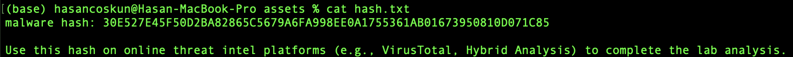
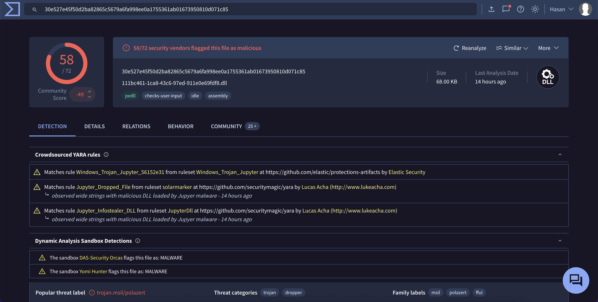
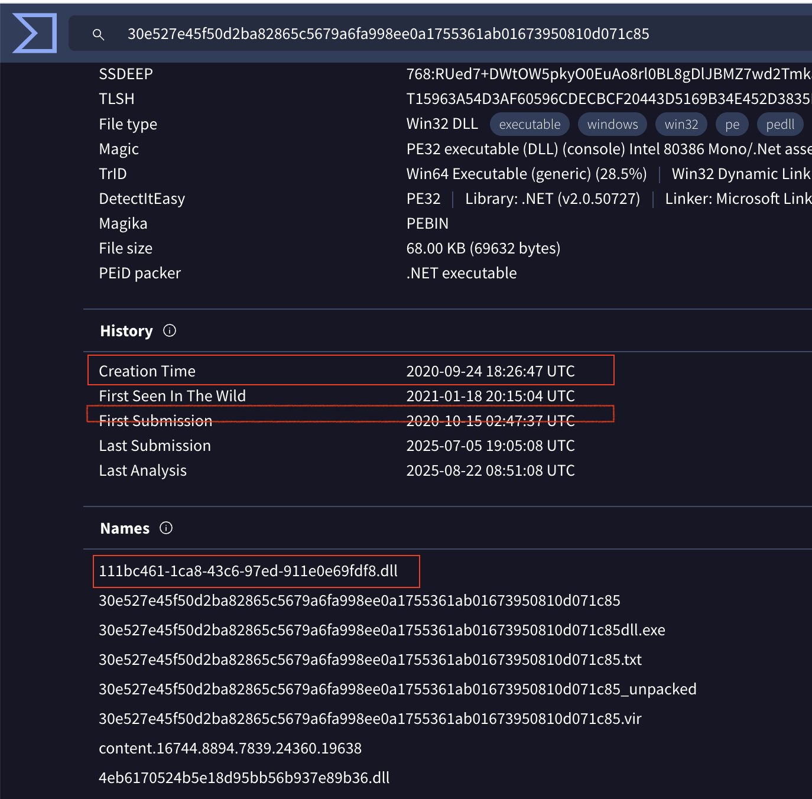
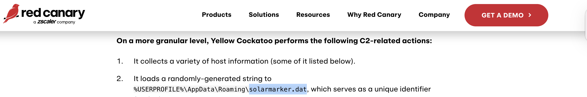
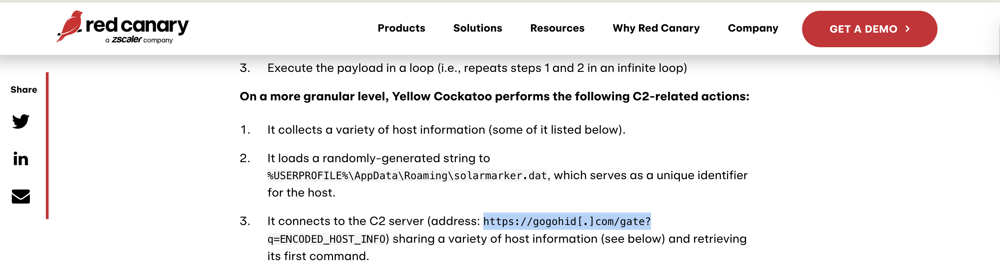

# Yellow RAT: Bir Tehdit İstihbaratı Vakasının Perde Arkası

Merhaba siber güvenlik meraklıları! Bu yazıda, CyberDefenders platformunda yer alan ve modern bir tehdit istihbaratı analistinin düşünce yapısını gerektiren "Yellow RAT" vakasını adım adım çözeceğiz. Yolculuğumuz, tek bir SHA256 hash'i ile başlayacak ve bizi, sadece otomatik tarama sonuçlarına değil, aynı zamanda harici güvenlik raporlarına ve topluluk tarafından oluşturulan istihbarata dayanarak bir saldırıyı aydınlatmaya götürecek.

Hazırsanız, istihbarat şapkalarımızı takalım ve bu çok katmanlı tehdidin izini sürelim!

## Olay Yeri: İlk Delilimiz ve Triage Aşaması

Vaka, bize tek bir **Indicator of Compromise (IOC)** ile başlıyor:



- **SHA256 Hash:** `30E527E45F50D2BA82865C5679A6FA998EE0A1755361AB01673950810D071C85`

Bir analist olarak ilk adımımız, bu dijital parmak izini kullanarak dosya hakkında hızlı bir ön bilgi (triage) toplamaktır. Bunun için ilk ve en önemli durağımız **VirusTotal**.



VirusTotal'ın "Detection" sekmesi bize anında kritik bilgiler sunar:
- **Popüler Tehdit Etiketi:** `trojan.msil/polazert`
- **Aile Etiketleri:** `polazert`, `fful`
- **Dosya Tipi:** `DLL`

Bu bilgiler, dosyanın `.NET` ile yazılmış, `Polazert` ailesine ait bir Truva Atı olduğunu düşündürüyor. Ancak, göreceğimiz gibi, hikaye bundan çok daha derin.

---

## Soru 1: Zararlı Yazılım Ailesinin Adı

> **Soru:** Understanding the adversary helps defend against attacks. What is the name of the malware family that causes abnormal network traffic? (Format: `****** ******** ***`)

### Analitik Yaklaşım

VirusTotal'daki otomatik etiketler (`Polazert` gibi), soruda verilen cevap formatıyla uyuşmuyor. Bu durum, cevabın daha spesifik bir tehdit istihbaratı raporunda saklı olduğunu gösteren bir ipucudur. Gerçek bir analizde, bu noktada dosyanın hash'ini veya bilinen aile isimlerini kullanarak Google gibi arama motorlarında harici raporlar ararız. Bu vaka, bizi **Red Canary** tarafından yayınlanan bir rapora yönlendiriyor.

### Kanıtları İnceleme

Bu vaka ile doğrudan ilişkili olan Red Canary raporu, analiz edilen tehdit kümesine **"Yellow Cockatoo"** adını vermektedir. Rapor, bu aktivitenin `Jupyter Infostealer` olarak da bilindiğini belirtir. CTF, bizden raporu yayınlayan firmanın verdiği ismi istemektedir.

**Cevap:** `Yellow Cockatoo RAT`

---

## Soru 2-3-4: Dosya Adı, Derleme ve İlk Tespit Zamanları

> **Soru 2:** As part of our incident response, knowing common filenames the malware uses can help scan other workstations for potential infection. What is the common filename associated with the malware discovered on our workstations? (Format: `********-****-****-****-************.***`)

> **Soru 3:** What is the compilation timestamp of the malware that infected our network?

> **Soru 4:** When was the malware first submitted to VirusTotal?

### Analitik Yaklaşım

Bu üç sorunun cevabı da VirusTotal'ın **"Details"** sekmesinde bulunur. Dosya adı "Names" bölümünde, derleme ve tespit zamanları ise "History" bölümünde yer alır. Cevap formatları, dosyanın yaşam döngüsü ve gizlenme teknikleri hakkında önemli ipuçları verir.

### Kanıtları İnceleme

VirusTotal'daki **"Details"** sekmesi, dosyanın meta verilerini ve bilinen adlarını listeler.



**Soru 2 - Dosya Adı:** "Names" bölümünde, GUID formatıyla birebir eşleşen `111bc461-1ca8-43c6-97ed-911e0e69fdf8.dll` dosya adı görülür. Bu, zararlının sisteme bulaştığında kullandığı yaygın dosya adıdır.

**Soru 3-4 - Zaman Bilgileri:** "History" bölümünde:
- **Creation Time (Derleme Zamanı):** `2020-09-24 18:26:47 UTC`
- **First Submission (İlk Gönderim):** `2020-10-15 02:47:37 UTC`

**Cevap 2:** `111bc461-1ca8-43c6-97ed-911e0e69fdf8.dll`
**Cevap 3:** `2020-09-24 18:26`
**Cevap 4:** `2020-10-15 02:47`

---

## Soru 5: AppData Klasörüne Bırakılan .dat Dosyası

> **Soru:** To completely eradicate the threat from Industries' systems, we need to identify all components dropped by the malware. What is the name of the .dat file that the malware dropped in the AppData folder?

### Analitik Yaklaşım

Bir zararlının sisteme bıraktığı dosyaları (dropped files) bulmak için davranışsal analiz sonuçlarına ihtiyacımız vardır. Bu bilgi, VirusTotal'ın standart analizinde her zaman görünmeyebilir. Bu nedenle, vaka ile ilişkili olan Red Canary'nin tehdit istihbaratı raporuna başvuruyoruz.

### Kanıtları İnceleme

Red Canary'nin "Yellow Cockatoo" raporu, zararlının davranışlarını detaylı bir şekilde açıklar.



Raporda, .NET RAT'in yetenekleri anlatılırken şu ifade yer alır: "It loads a randomly-generated string to `%USERPROFILE%\AppData\Roaming\solarmarker.dat`...". Bu, zararlının kurbanı takip etmek için `AppData` klasörüne `solarmarker.dat` adında bir dosya bıraktığını kesin olarak kanıtlar.

**Cevap:** `solarmarker.dat`

---

## Soru 6: Komuta & Kontrol (C2) Sunucusu

> **Soru:** It is crucial to identify the C2 servers with which the malware communicates to block its communication and prevent further data exfiltration. What is the C2 server that the malware is communicating with?

### Analitik Yaklaşım

Aynı tehdit istihbaratı raporu, zararlının komuta ve kontrol sunucusunun adresini de içerecektir. Bu, bir olaya müdahale sırasında ağ trafiğini engellemek için gereken en kritik bilgilerden biridir.

### Kanıtları İnceleme

Red Canary raporunun C2 iletişimi ile ilgili bölümünü incelediğimizde aradığımız cevabı buluyoruz.



Raporda, "It connects to the C2 server (address: `https://gogohid[.]com/gate`..." ifadesi, zararlının iletişim kurduğu alan adını net bir şekilde ortaya koymaktadır.

**Cevap:** `https://gogohid.com`

---

## Sonuç: Saldırı Zincirinin Tamamı

Tek bir hash'ten yola çıkarak, çok katmanlı bir tehdidin tüm anatomisini ortaya çıkardık:

1. **Aile Tespiti:** Zararlının, Red Canary tarafından **Yellow Cockatoo RAT** olarak adlandırılan aktivite kümesine ait olduğunu tespit ettik.
2. **Kalıcılık:** Sisteme, kendini **GUID** formatında bir `.dll` dosyası olarak kopyalıyor.
3. **Yaşam Döngüsü:** 2020 sonlarında oluşturulmuş ve kısa bir süre sonra güvenlik topluluğu tarafından tespit edilmiş.
4. **İz Bırakma:** Kurbanı takip etmek için `AppData` klasörüne **`solarmarker.dat`** adında bir dosya bırakıyor.
5. **İletişim:** **`https://gogohid.com`** adresindeki C2 sunucusuyla haberleşerek komut alıyor ve veri sızdırıyor.

Bu vaka, modern siber güvenlik analizinin sadece tek bir araca bağlı olmadığını; VirusTotal, harici tehdit raporları ve topluluk istihbaratı gibi farklı kaynakları birleştirerek büyük resmi görmeyi gerektirdiğini mükemmel bir şekilde göstermektedir.

---

## Teknik Detaylar ve Öğrenilen Dersler

### Kullanılan Analiz Araçları
- **VirusTotal:** Otomatik zararlı yazılım tespiti ve dosya analizi
- **Red Canary:** Harici tehdit istihbaratı raporları
- **Google/Bing:** Hash tabanlı arama ve topluluk istihbaratı
- **Tehdit İstihbaratı Platformları:** IOC korelasyonu ve analizi

### Protokol ve Teknik Detayları
- **SHA256 Hash:** Dosya bütünlüğü ve kimlik doğrulama
- **GUID Formatı:** Windows sistemlerinde benzersiz tanımlayıcılar
- **DLL Dosyaları:** Windows dinamik bağlantı kütüphaneleri
- **AppData Klasörü:** Windows kullanıcı veri dizini
- **HTTPS C2:** Şifreli komuta ve kontrol iletişimi

### Tehdit İstihbaratı Metodolojisi
1. **IOC Tespiti:** Hash, dosya adı, IP adresi gibi göstergeler
2. **Triage Analizi:** VirusTotal gibi platformlarda hızlı değerlendirme
3. **Harici Raporlar:** Red Canary gibi güvenlik firmalarının detaylı analizleri
4. **Topluluk İstihbaratı:** Güvenlik araştırmacılarının paylaştığı bilgiler
5. **Korelasyon:** Farklı kaynaklardan gelen bilgilerin birleştirilmesi
6. **IOC Çıkarımı:** Yeni göstergelerin tespit edilmesi

### Güvenlik Önlemleri
1. **Hash Tabanlı Tespit:** Bilinen zararlı yazılım imzaları
2. **Davranışsal Analiz:** Anormal dosya aktiviteleri
3. **Ağ İzleme:** C2 sunucularına giden trafik
4. **Endpoint Koruması:** Gelişmiş tehdit tespiti
5. **Tehdit İstihbaratı:** Güncel IOC veritabanları

### MITRE ATT&CK Eşleştirmesi
- **T1027.002 (Obfuscated Files or Information: Software Packing):** DLL dosyasının GUID formatında gizlenmesi
- **T1055.001 (Process Injection: Dynamic-link Library Injection):** .NET DLL olarak çalışması
- **T1071.001 (Application Layer Protocol: Web Protocols):** HTTPS üzerinden C2 iletişimi
- **T1053.005 (Scheduled Task/Job: Scheduled Task):** AppData klasöründe kalıcılık dosyası
- **T1036 (Masquerading):** Meşru DLL dosyası olarak gizlenmesi

---

## Tekrarlanabilirlik ve Komutlar

Aşağıdaki komutlar, bu depodaki dizin düzeni ile birebir çalışacak şekilde verilmiştir.

```bash
# Hash analizi
echo "30E527E45F50D2BA82865C5679A6FA998EE0A1755361AB01673950810D071C85" | xxd -r -p | file -

# VirusTotal API kullanımı (opsiyonel)
curl -s "https://www.virustotal.com/vtapi/v2/file/report" \
  --data-urlencode "apikey=YOUR_API_KEY" \
  --data-urlencode "resource=30E527E45F50D2BA82865C5679A6FA998EE0A1755361AB01673950810D071C85"

# Hash arama (Google, Bing)
# "30E527E45F50D2BA82865C5679A6FA998EE0A1755361AB01673950810D071C85" + "Red Canary"
# "Yellow Cockatoo" + "malware analysis"

# Dosya türü analizi
file -b [dosya_adi]
strings [dosya_adi] | grep -i "yellow\|cockatoo\|jupyter"
```

---

*Bu yazı, siber güvenlik eğitimi amaçlı hazırlanmıştır. Her analiz, kendine özgü detaylar ve zorluklar içerir. Gerçek vakalarda benzer teknikler kullanılarak siber saldırılar tespit edilir ve önlenir.*

---

Yazar: [iamhasancoskun](https://github.com/iamhasancoskun)
